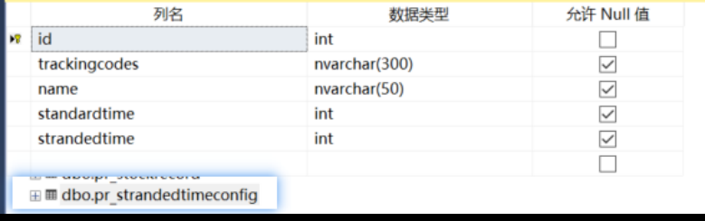
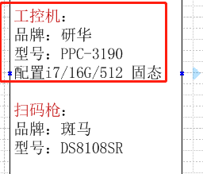

## 问题与解决方案

### - 创建新的.Net FrameWork项目遇到了一些问题

```
今天想尝试创建新的 后台项目，我也拿不准用.NET FrameWork 还是 .Net Core,看之前我做的都是 .NET FrameWork 。于是我新建了一个.Net FrameWok项目，但是当我想改变虚拟目录 的运行端口时，报了一个 无法访问此网站 的错误。网上搜索，改配置文件或是VS设置 都解决不了。于是 copy 了 22ChongQingMES 项目 的 后端代码。复制粘贴后。修改了 文件夹/解决方案/目录的名称，然后使用idea 查找修改前的目录名，进行全局修改，然后重新用VS打开项目 =》 项目端口可以修改 且 查询端口 也可以访问到，问题解决。
ps: 解决方案文件可以用 notepad++或 记事本打开，里面也有启动的路径，是需要修改的。但还是建议 修改全局。这样一劳永逸

未来一段时间应该会用这种方式来 新建 .Net FrameWork 项目了
```

### - 窗口伸缩适配

来源：长春一汽二次涂装项目——能源信息——计划录入

### 说明

```
这部分是下面的html代码：
            <div id="p" class="easyui-panel" data-options="fit:true" style="border: 0px">
                <div id="container">
                    <div class="box">
                
使用 #container + .box 包裹盒子 实现伸缩布局
#p 用于触发事件
```

### css

```
#container {
    width: 100%;
    height: 100%;
    box-sizing: border-box;
    overflow: hidden;
}

.box {
    overflow: hidden;
    position: relative;
    width: 1332px;
    height: 673px;
}
```

### html

```
<div id="pagetitle" class="easyui-panel" title="计划录入" data-options="fit:true" style="padding: 5px;">
        <div id="p" class="easyui-panel" data-options="fit:true" style="border: 0px">
            <div id="container">
                <div class="box">
                    <div class="easyui-layout" data-options="fit:true">
                        <div data-options="region:'north',border:false">
                            <div class="search_condition">
                                <label>年份：</label>
                                <input id="year" />
                            </div>
                            <div class="search_condition">
                                <a href="#" id="btnYearPlanQuery" class="easyui-linkbutton functionbutton" iconcls="icon-search">查询</a>
                                <a href="#" id="btnYearPlanRefresh" class="easyui-linkbutton functionbutton" iconcls="icon-reload">刷新</a>
                                <a href="#" id="btnYearPlanNew" class="easyui-linkbutton functionbutton" iconcls="icon-add">新增</a>
                                <a href="#" id="btnYearPlanEdit" class="easyui-linkbutton functionbutton" iconcls="icon-edit">编辑</a>
                                <a href="#" id="btnYearPlanDelete" class="easyui-linkbutton functionbutton" iconcls="icon-remove">删除</a>
                            </div>
                        </div>
                        <div data-options="region:'west',border:false" style="width: 48%;">
                            <table id="dg_yearplan" title="年度计划录入" style="width: 100%; height: 100%"
                                rownumbers="true" striped="true" singleselect="true" pagination="false"
                                data-options="url:'<%=ResolveUrl("~/WebHttpHandlers/ShiftInfo/ShiftManagementHandler.ashx?method=Query") %>'">
                                <thead>
                                    <tr>
                                        <th field="shiftname" width="80px" align="center" halign="center">年份</th>
                                        <th field="shiftname" width="80px" align="center" halign="center">单车消耗</th>
                                        <th field="shiftname" width="80px" align="center" halign="center">电能费用</th>
                                        <th field="shiftname" width="80px" align="center" halign="center">水费用</th>
                                        <th field="shiftname" width="80px" align="center" halign="center">天然气费用</th>
                                        <th field="shiftname" width="80px" align="center" halign="center">高温水费用</th>
                                        <th field="shiftname" width="80px" align="center" halign="center">采暖水费用</th>
                                    </tr>
                                </thead>
                            </table>
                        </div>
                        <div data-options="region:'east',border:false" style="width: 52%; padding-left: 4px">
                            <div style="height: 100%;">
                                <div class="easyui-panel" title="分区计划录入" data-options="fit:true,border:true">
                                    <div class="easyui-layout" data-options="fit:true">
                                        <div data-options="region:'north',border:false" style="padding: 5px;">
                                            <div class="search_condition">
                                                <label>月份：</label>
                                                <select id="parm_month" class="easyui-combobox" style="width: 120px;"
                                                    data-options="panelHeight: 'auto', panelMaxHeight: 400,editable:false,valueField: 'label',textField: 'value',
                                                   iconWidth:22, icons:[{iconCls:'icon-clear',handler:function(e){ $(e.data.target).combobox('clear');}}]">
                                                    <option value="" selected="selected">所有</option>
                                                    <option value="1">一月</option>
                                                    <option value="2">二月</option>
                                                    <option value="3">三月</option>
                                                    <option value="4">四月</option>
                                                    <option value="5">五月</option>
                                                    <option value="6">六月</option>
                                                    <option value="7">七月</option>
                                                    <option value="8">八月</option>
                                                    <option value="9">九月</option>
                                                    <option value="10">十月</option>
                                                    <option value="11">十一月</option>
                                                    <option value="12">十二月</option>
                                                </select>
                                            </div>
                                            <div class="search_condition">
                                                <label>区域：</label>
                                                <input id="parm_area" class="easyui-combobox textinput" style="width: 120px;"
                                                    data-options="panelHeight: 'auto', panelMaxHeight: 400,valueField: 'code',textField: 'text',editable:false,
                                      url:'<%=ResolveUrl("~/WebHttpHandlers/BaseInfo/BaseInfoHandler.ashx?method=EnergyAreaList") %>',
                                      iconWidth:22, icons:[{iconCls:'icon-clear',handler:function(e){ $(e.data.target).combobox('clear');}}]" />
                                            </div>
                                            <div class="search_condition">
                                                <a href="#" id="btnQuery" class="easyui-linkbutton functionbutton" iconcls="icon-search">查询</a>
                                                <a href="#" id="btnRefresh" class="easyui-linkbutton functionbutton" iconcls="icon-reload">刷新</a>
                                                <a href="#" id="btnNew" class="easyui-linkbutton functionbutton" iconcls="icon-add">新增</a>
                                                <a href="#" id="btnEdit" class="easyui-linkbutton functionbutton" iconcls="icon-edit">编辑</a>
                                                <a href="#" id="btnDelete" class="easyui-linkbutton functionbutton" iconcls="icon-remove">删除</a>
                                            </div>
                                        </div>
                                        <div data-options="region:'center'" style="border-left-width: 0px; border-right-width: 0px; border-bottom-width: 0px">
                                            <table id="dg_areaplan" class="easyui-datagrid" style="width: 100%; height: 100%"
                                                striped="true" singleselect="true" rownumbers="true" data-options="border:0,
                                               url:'<%=ResolveUrl("~/WebHttpHandlers/ShiftInfo/ShiftManagementHandler.ashx?method=TimeQuery") %>'">
                                                <thead>
                                                    <tr>
                                                        <th field="eventname" width="120px" align="center" halign="center">分区</th>
                                                        <th field="begintime" width="120px" align="center" halign="center">月份</th>
                                                        <th field="endtime" width="120px" align="center" halign="center">电能用量</th>
                                                        <th field="breakbegintime" width="120px" align="center" halign="center">水量</th>
                                                        <th field="breakendtime" width="120px" align="center" halign="center">天然气用量</th>
                                                    </tr>
                                                </thead>
                                            </table>
                                        </div>
                                    </div>
                                </div>
                            </div>
                        </div>
                    </div>
                </div>
            </div>
        </div>
    </div>
```

### js

```
    $(function () {
        $("#p").panel({
            onResize: function () {
                onwindowresize();
            }
        });
    });

    //保存DIV大小
    save_h1 = 0;
    save_w1 = 0;
    //窗体大小变化时调整缩放比例
    function divresize() {
        //return;
        h = $(".box").height().toFixed(4);
        w = $(".box").width().toFixed(4);
        h1 = $("#container").height().toFixed(4);
        w1 = $("#container").width().toFixed(4);
        if (w1 != save_w1 || h1 != save_h1) {
            //div大小有变动，保持当前大小并变换显示比例
            save_w1 = w1;
            save_h1 = h1;
            var ratioy = h1 / h;
            var ratiox = w1 / w;
            $('.box').css({
                'transform': 'scale(' + ratiox + ', ' + ratioy + ')',
                'transform-origin': '0 0',
            });
        }
    };

    var timer1 = 0;   //计时器
    function onwindowresize() {
        clearTimeout(timer1);
        timer1 = setTimeout(divresize, 100);
    };
    window.onload = onwindowresize;
    window.onresize = onwindowresize;
```

## 2022年

简介：2022年3月14日 在宜科电子入职

### 3月

#### 第一周

##### 2022年3月14日 周一

```
1.搭建环境【sqlserver2016、VS2019、notepad++、typora、idea、有道、clash、百度云盘、谷歌浏览器、迅雷、snipaste截图软件、office2016专业版】
```

##### 2022年3月15日 周二

```
1.搭建完毕开发环境
2.创建svn用户，安装配置本地ToriseSVN环境
3.熟悉 佛山-一汽大众-中控程序 项目
```

##### 2022年3月16日 周三

```
1.学习github上的mes系统前端项目
2.熟悉佛山 一汽大众 中控程序 的前端，和 前端C#的交互方式
```

##### 2022年3月18日 周四

```
1. 从前端到后端整个流程中，查找自己不会/不熟悉的技术点
2. 学习ado.net 连接数据库的方式
3. 熟悉 sql 的 某些关键字，重点熟悉了 left join/right join/inner join
```

##### 2022年3月18日 周五

```
1. 熟悉 sqlserver 的存储过程
2. 移植之前熟悉的技术点
3. 扩充静态资源
```

#### 第二周

##### 2022年3月21日 周一

```
1. 和章工学习佛山 一汽大众 中控系统的 项目
2. 看菜单项实现，看授权的实现
```

##### 2022年3月22日 周二

```
1. 与章工确认数据结构，并完成标题和数据的json制作
2. 在数据库加入对应页面，在页面做显示
3. 在页面用假数据（商量好的数据结构），完成数据在 日产量报表的 展示
```

##### 2022年3月23日周三

```
1. 完善前端部分，将修改数据，进行前台的数据显示测试
2. 将查询条件+按钮，在前端实现（借鉴DailyYieldQuery页面）。
3. 修改页面名称
```

##### 2022年3月24日 周四

```
1. 调试后台接口，并在前台对表格内的数据做处理
2. 处理后台的JSON格式，经常因为有字段没有引号，而无法解析！！！
3. 在前台处理后台传输的数据，做好用户的使用交互
```

##### 2022年3月25日 周五

```
1. 完成前台合并行，添加导出Excel按钮
2. 正在开发 定制化导出 Excel 的功能
```


#### 第三周

##### 2022年3月28日 周一

```
1. 根据 汇总表 的Excel文件，查找到对应的 后台 样板程序
2. 和吕工沟通，根据用户的需求，更改汇总表的前台展示部分
```

##### 2022年3月29日 周二

```
1. 开发 汇总表的 Excel导出功能 的后台部分。定制 页面导出的 样式
2. 和吕工沟通，根据用户的需求，更改汇总表的前台和导出表格的样式
```

##### 2022年3月30日 周三

```
1. 完成 汇总表的 前台 和 后台业务功能 测试。
2. 完成汇总表第一版 的 提交 
```

##### 2022年3月31日 周四

```
1. 修改 能源分析页面 的前台部分。
2. 和吴工沟通 能源分析页面的 数据展示实现
```

##### 2022年4月1日 周五

```
1. 依据用户的需求，更改能源分析页面的 Excel导出功能
2. 修改 能源分析页面 的存储过程。
3. 提交 能源分析页面的 修改。备份相关存储过程
```

##### 2022年4月2日周六

```
1. 参与项目梳理工作，用腾讯会议的方式，学习页面实现与业务逻辑
2. 新增 网络调用失败 弹窗的 定时关闭
3. 正在修改 日产量汇总表的 导出Excel 功能错误【2023年1月13日10:43:05回顾：当时遇到了C#代码异常，检查后发现在创建颜色表格对象时，由于是在for循环内创建cell之后创建的style对象，for循环创建了大量重复的style对象。在和章向忠章工沟通后，将style对象提取到全局，只建立了5个style颜色对象，在需要的时候进行复用，解决了资源异常的问题。】
```


### 4月

#### 第一周

##### 2022年4月6日 周三

```
学习存储过程相关代码，包括实现方式，语法结构等
```

##### 2022年4月7日周四

```
开始实践谷粒商城项目
```

##### 2022年4月8日周五

```
1.实践谷粒商城项目，搭建基本环境【编译器，jdk，中间件，虚拟机】
2.修改 日产量汇总表 的功能 —— 导出Excel中 静态表头改为动态表头
3.新增需求：不同时间模型，查询表格数不同。 在 日产量汇总表 页面 可能展示 一张/二张/三张 表，并导出
```

#### 第二周

##### 2022年4月11日周一

```
1. 根据需求开发 日产量汇总表，让章工看一下效果，继续后续的开发
2. 修改日产量汇总表的前端实现【将table变成动态实现】
3. 备份 佛山中控的 测试库，在 本地 使用 4-8的版本
```

##### 2022年4月12日周二

```
开发 日产量汇总表 的后台 Excel导出功能【表头部分还未修改，表内数据正在开发调试很快完成】
```

##### 2022年4月13日周三

```
1. 开发完成 日产量汇总表 的 需求修改
2. 测试 日产量汇总表 更改后的功能
3. 日产量汇总表 代码 提交到svn
```

##### 2022年4月14日周四

```
1. 学习 与OPC交互的方式，包括 软件交互(C#)和硬件交互(KepServer/OPC Client)
2. 通过调用 模拟设备数据，实现跑马灯程序
```

##### 2022年4月15日周五

```
1. 学习Sql的实用技巧
2. 完成 OPC 模拟设备 的 订阅与读取操作，完成跑马灯案例
3. 练习谷粒商城项目
```

#### 第三周

##### 2022年4月18日周一

```
前提：章工发现服务器中了勒索病毒，并查询解决方案
1. 安装360杀毒，腾讯管家杀毒，进行全局杀毒。并把所有的移动设备，包括U盘/移动硬盘，扫描一遍
2. 学习谷粒商城项目
```

##### 2022年4月19日周二

```
练习谷粒商城项目，学习linux的使用，项目架构的搭建
```

##### 2022年4月20日周三

```
学习谷粒商城项目的 renrenfast接口自动生成【列表数据的增删改查】
```

##### 2022年4月21日周四

```
1. 参与 魏工 组织的 Mui+ html5 APi 的移动端 培训
2. 运行MUI 的 demo 项目【mui在页面上的实现示例】
3. 运行html5 API 的 demo 项目【包括 操作 安卓设备的camera实例，读取 安卓设备参数实例等】
4. 运行 赛达平台升级工业互联网项目。【李工帮助 配置了Windows的IIS服务并设置好了C#程序的端口号和程序名称，将打包好的C#后台程序AppAPI部署到安卓设备】【通过 魏工给的pad 在HbuilderX编辑器环境下，把前台界面展示到了 安卓设备上】
```

##### 2022年4月22日周五

```
1. 学习 MUI 的 demo 项目
1. 学习 html5 API 的 demo 项目
1. 学习 赛达平台升级工业互联网项目
```

#### 第四周

##### 2022年4月24日周日

```
熟悉 C#后台程序的启动，在没有前台的支持下，需要 协议:IP:端口号/处理文件路径/?参数对象  来访问对应的接口地址，获取数据
如： localhost:9001/AppAPI/xxxHandler.ashx/?mehotd= Query
```

##### 2022年4月25日周一

```
尝试移植代码，把 赛达平台那个 复杂项目做优化 到 章工 给的 实例上
```

##### 2022年4月26日周二

```
1. 解决IIS服务器无法连接的问题
【windows添加/删除功能 =》 启用windows服务 找 internet information service 的服务】
【Windows Defender 防火墙 =》高级设置 =》入站规则 =》配置 8001端口】
完成以上两项，问题解决
```

##### 2022年4月27日周三

```
1.解决 显示预配表头 的问题，原因是IIS服务只允许在内网环境下 使用，手机热点/蓝牙热点 都不能用
2.开发 AppWMS 实例
```

##### 2022年4月28日周四

```
1.熟悉AppAPI后台
2.学习谷粒商城
```

##### 2022年4月29日周五

```
1.继续周四的工作
2.AppWMS 的菜单选择按钮/菜单项 动态化，
```


### 5月

#### 第一周

##### 2022年5月5日 周四

```
1.AppWMS 的左侧列表动态化，重构 index 页面
2.新增 主页跳转  左右立库 功能
```

##### 2022年5月6日 周五

```
实现在页面 摆放60个菜单项。备份当前项目，再根据需求继续开发 
```

##### 2022年5月7日 周六

```
1.开会确定 重庆演示项目 的整体需求【数据库表的确定，数据关系的确定(vga,订单，仓储，立库等等)】
2.开发前台的 立库页面 的 静态实现
```

#### 第二周

##### 2022年5月9日 周一

```
1. 移植 订单页面 到 重庆演示项目中
2. 开发 订单+加工装配 页面
3. 开发 静态页完成后，确认静态页展现的效果， 再进行 后台接口的 数据交互格式 和 前后台交互
4. 解决 mi-pad 无法连接 IIS 服务的问题。
  (pad+XBuilder) => 组成客户端 【pad与XBuilder用USB相连】
  (IIS) => 服务端【(IIS 服务需要在 同一局域网下 才能使用，所以pad也需要 和 电脑 在同一网络下)】 
```

##### 2022年5月10日周二

```
1. 开发 换线装配（订单页） 界面。无论移植layer插件 还是 原版页面 都会有所卡顿
2. 使用原生 开发 左侧 table。在原生开发后，页面的响应速度有了很大的提升
PS：工业移动端，最好都用原生开发，用了很多的插件，都会有卡顿
```

##### 2022年5月11日周三

```
1. 开发 AppWMS 项目
2. 学习 websocket 的 创建方法中的 protocal参数的使用
```

##### 2022年5月12日周四

```
1. 确认 重庆工职院MES 项目 的 数据库表
2. 开发 重庆工职院MES 仓储页面 的 存储过程 
```

##### 2022年5月13日周五

```
1.确认 重庆互联网 项目 的 仓储 基础 订单表
2.熟悉并开发 重庆互联网 项目 的 存储过程。
```

##### 备注【2023年1月13日11:40:25回顾】

```
订单屏出现了卡屏问题，问题是bootstrap插件带来的，后期我也用layui尝试过，还是会卡，插件会导致移动端的订单页卡死。
后来使用原生组件开发，解决问题
```


##### 第三周

###### 2022年5月16日周一

```
请假
```

###### 2022年5月17日周二

```
1.开发 立库 页 —— 存储过程的 查询立库页、websocket更新、物料转换 等过程
2.开发 订单 页 —— 存储过程的 查询左侧列表 过程
```

###### 2022年5月18日周三

```
开发 订单页 —— 存储过程 的 查询右侧列表、websocket更新、按钮状态、上移、下移、停止/关闭 的 过程
```

###### 2022年5月19日周四

```
(汇报时-不重要)1. 开会 解决 sch_running 数据表 和 更新websocket 的数据问题。
(汇报时-不重要)2. 开会培训 AppAPI的搭建，websocket后台书写；KEPserver 使用
3. 依据AppAPI(18赛达平台升级工业互联网项目 GRJ2103)移植并搭建 重庆工职院MES 项目 的后端 AppWMSAPI
```

###### 2022年5月20日周五

```
1. 根据 主页的 UI 开发 主页 的 页面 和 交互
2. 开发 立库页面(机加工库,环线库) 的 的 后端API ，包括 托盘查询接口、托盘修改接口、websocket更新接口
```


##### 第四周

###### 2022年5月23日周一

```
1.开发 机加工库页面 的 前端页面
2.联调 机加工库页面 的 前后台
```

###### 2022年5月24日周二

```
1.开发 环线库页面 的 前端页面
2.联调 环线库页面 的 前后台

目前进度：还剩 订单页面 的 OpenWebSocket、MoveUp、MoveDown、RunState
```

###### 2022年5月25日周三

```
开发 环线订单页 和 CNC加工订单页 后端 API。  包括：订单查询、订单更新、执行状态查询、执行状态修改、订单上下移

目前进度：还剩 订单页面 的 MoveUp、MoveDown、RunState
```

###### 2022年5月26日周四

```
1.开发 环线订单页 和 CNC加工订单页 后端 API
2.开发 环线订单页 和 CNC加工订单页 页面 + JS
3.修改 立库和订单页 的样式
4.优化 修改按钮状态的 存储过程
```

###### 2022年5月27日周五

```
1.开发 环线订单页 和 CNC加工订单页 页面 + JS
2.联调 环线订单页 和 CNC加工订单页 的前后端功能
```

###### 周报

```
1. 开发 机加工库 与 环线库 的 前端JS 和 后端C#接口(例：库位更新接口，全部库位信息 查询,按钮状态查询修改等）
2. 开发 环线订单 和 CNC加工订单 的 前端JS 和 后端C#接口(例：订单查询、订单更新、执行状态查询、执行状态修改、订单上下移等)
3. 修改 立库页 和 订单页 的 样式，将 图片 全部改为 矢量图SVG
4. 优化 修改按钮状态 的存储过程
5. 优化 前端代码，通过 JS 初始化 页面的 HTML
```


##### 第五周

###### 2022年5月30日周一

```
休假 和 周日 换调休
```

###### 2022年5月31日周二

```
腾讯会议学习佛山中控项目
```

###### 2022年6月1日周三

```
腾讯会议学习佛山中控项目
```

###### 2022年6月2日周四

```
1.优化 重庆工职院的 前端部分
2.练习 佛山中控项目
```

###### 周报

```
1. 优化 重庆工职院 的 前端部分，包括 立库页面 和 订单页面 的静态样式整合 和 js整合
2. 学习 并 熟悉 ai 文件的 绘制方式
3. 熟悉 佛山中控项目 中 使用Echarts实现的功能代码
4. 熟悉 佛山中控项目 的 页面授权的功能代码
```


### 6月


#### 第二周

##### 2022年6月6日周一

```
1.备份测试数据库，本地数据库，重庆工职院 的 前台项目
2.整合重庆工职院的 后台数据库，对前台项目 做 前后端的联调
```

##### 2022年6月7日周二

```
1.解决Hbuilder无有效证书，项目中有中文路径或文件的问题
2.使用Hbuilder完成App的打包
```

##### 2022年6月8日周三

```
与重庆工职院 项目 现场人员沟通 项目联调事宜
```

##### 2022年6月9日周四

```
1.接手 N117_Andon 项目 的 web重构 【重构项目叫AndonScreen】
2.搭建 AndonScreen 项目 的 web目录结构【新项目叫 AndonScreen】
3.开发 AndonScreen 项目 的 静态页
```

##### 2022年6月10日周五

```
1.开发 AndonScreen 项目 的 静态页
2.熟悉并绘制 AndonScreen 工位部分的 svg
```

##### 2022年6月11日周六

```
1.绘制 AndonScreen 工位部分的 svg
```

##### 周报

```
1.整合重庆工职院项目 的 前后台数据库，并做备份
2.在测试环境 调试 前台项目，保证数据的准确和页面的稳定
3.解决Hbuilder 的证书问题，将 重庆工职院的 前台项目打包成apk
4.与 重庆工职院 现场人员 沟通 联调时间，完成前台页面的 生产环境调试
5.接手N117_Andon项目的重构，搭建AndonScreen项目
6.开发AndonScreen的静态页
7.绘制AndonScreen 工位区域 的 人工上下件 svg
```


#### 第三周

##### 2022年6月13日周一

```
绘制AndonScreen中svg的 滚边岛/地板岛/焊接岛/人工上下件 
```

##### 2022年6月14日周二

```
1.绘制AndonScreen中svg的剩余部分
2.备份并导出 AndonScreen工位的svg和ai
```

##### 2022年6月15日周三

```
1.AndonScreen 页面引入 SVG代码，调整样式表的代码，实现屏幕自适应
2.开发完成 查询接口，完成前后台的调试与测试
```

##### 2022年6月16日周四

```
1.重建 N117Andon 数据库。
2.熟悉CEF(Chromium嵌入式框架)。
3.在公告栏加入iframe标签，完成iframe的高度自适应
```

##### 2022年6月17日周五

```
1.向 N117Andon 数据库 插入 模拟数据
2.将静态页导入CEF框架，重建AndonScreen项目
3.修改 前台的回显逻辑，完成 页面左侧 的查询功能
```

##### 周报

```
1. 绘制AndonScreen项目所需svg
2. 导入svg代码，调试页面样式，实现自适应
3. 完成 查询接口 和 前后台联调
4. 重建N117Andon数据库
5. 熟悉CEF(Chromium嵌入式框架)
6.在公告栏加入iframe标签，实现iframe的高度自适应
7.插入模拟数据，使用CEF框架获取数据。修改 页面回显逻辑，完成查询功能的联调
```


#### 第四周

##### 2022年6月20日周一

```
1.按照 N11Andon的 CAD图 确定 SVG上 各个电器件的 ID
2.修改AndonScreen的 svg
```

##### 2022年6月21日周二

```
1.按照N117Andon现场 设备图，修改AndonScreen 的 svg 
2.调整前端页面布局
```

##### 2022年6月22日周三

```
请假
```

##### 2022年6月23日周四

```
需做任务：1.修改id，给 灯 添加 自定义属性
		2.修改VIN和INFO的id，用标准命名
		3.用户页面是 在 D 盘下 Notice 文件夹 中 的notice.html （位置固定的html）
		4.iframe 的src 后面加个时戳：src="https://www.sina.com.cn?a=111111"
		
完成：
1.修改 svg 的 id，保证ST和ST1查找的元素的准确性
2.修改iframe标签的属性，隐藏滚动条
		
```

##### 2022年6月24日周五

```
1.在数据库加入测试数据
2.完成前台展现逻辑
3.测试展现逻辑，修改逻辑
```

##### 周报

```
1.根据 N117Andon 的 CAD图 修改 SVG的器件ID
2.修改 AndonScreen 的 前端 样式
3.完成 AndonScreen 的 iframe 页面刷新
4.解决iframe 的显示bug
5.录入测试数据，测试AndonScreen项目的业务功能，调试修改前后端代码
```


#### 第五周

##### 2022年6月27日周一

```
1. 解决 AndonScreen 页面 修改灯状态后 不重新渲染的问题
2. 完成 告警统计 部分 的前后端交互，并初步测试
```

##### 2022年6月28日周二

```
1.重新注册 Hbuilder 账号
2.使用传统方式 给 重庆工职院项目 进行打包测试
```

##### 2022年6月29日周三

```
请假一天
```

##### 2022年6月30日周四

```
修改 重庆工职院Mes项目的 静态页部分
```

##### 2022年7月1日周五

```
修改 存储过程中的 订单 相关字段，重做 后端的 业务逻辑
```


##### 周报

```
1. 解决 AndonScreen 页面 修改灯状态后 不重新渲染的问题
2. 完成 告警统计 部分 的前后端交互，并初步测试
3. 重新注册 Hbuilder 账号
4. 使用传统方式 给 重庆工职院项目 进行打包测试5
5. 修改 重庆工职院Mes项目的 静态页部分
6. 修改 存储过程中的 订单页 相关字段，修改 后端的 业务代码
```


### 7月

#### 第一周

##### 2022年7月4日周一

```
1.优化 AndonScreen 的前台代码
2.配合重庆现场 做前台项目 调试
```

##### 2022年7月5日周二

```
1.新增并修改AndonScreen 的svg内容
2.修改svg部分的h5+css
```

##### 2022年7月6日周三

```
1.学习佛山中控项目的default页面的自适应写法
2.使用生产环境参数 打包 重庆工职院 前台项目 apk
```

##### 2022年7月7日周四

```
1.配合重庆现场联调前台项目
2.修改 AndonScreen项目 的 web部分
3.配合佛山现场 开发仪表盘 组件
```

##### 2022年7月8日周五

```
配合佛山现场 开发仪表盘 组件
```

##### 周报

```
1.根据 重庆现场 的 pad分辨率 修改前台样式表
2.使用生产环境参数 打包 apk。与重庆现场的李工联络，完成pad的安装调试。
3.优化 AndonScreen 的前台代码
4.按需求 修改重做 AndonScreen 的 SVG，并更新index.html
5.配合佛山现场 开发仪表盘 组件
```

#### 第二周

##### 2022年7月11日周一

```
1.配合重庆现场 调试 前台项目
2.学习KepServer的实例项目
3.封装仪表盘控件
```

##### 2022年7月12日周二

```
1.确认Andon项目的客户需求和修改方案
2.重做SVG内部元素的比例
```

##### 2022年7月13日周三

```
1.根据CAD图修改SVG的 样式，布局，重做svg中各个元素的位置和尺寸
2.根据 AGV数据OPC导入 文件 在 svg 中 各区域标出 特定的agv元素
```

##### 2022年7月14日周四

```
1.根据CAD图修改SVG的 样式，布局
2.根据 Excel 与 Sqlserver 确认器件 的 ID ，并修改 SVG
3.与重庆现场做联调，使用新的ip更新apk信息
```

##### 2022年7月15日周五

```
1.根据Excel在SVG中标注好对应的设备和告警编码Id
2.调整SVG
3.学习AndonScreen 项目 的后台数据实现

PS：Andon项目后台数据实现 详细流程： 
      - 数据后台是由 宜科电子提供一个服务  连接KepServer和SqlserverDB
      - 宜科电子服务会更新 数据到DB，同时更新RealTimeSignal、Records、Tag 三张表
      - 实时信号表RealTimeSignal 会将数据同步到 告警记录表Records 和 大屏数据表Tag 中
      - 最终 大屏 得到 了数据更新的提示，通过CEF框架更新数据
```

##### 周报

```
1.配合重庆现场联调 前台项目，根据生产环境参数，更新APK包
2.在 AndonSCreen 的SVG中新增 告警信号 和 急停安全信号
3.根据客户的需求，针对性修改 svg 的样式和布局
4.由于重庆现场库位变化，重新调整 立库页面的 元素位置和布局
```


#### 第三周

##### 2022年7月18日周一

```
1.修改AndonScreen项目的前端页面(1.改左侧栏宽度缩写，2.告警分析图块高度缩写小，3.告警内容块高度扩大，改成marquee从下到上滚动，此处需改js，4.替换中间栏的SVG)
```

##### 2022年7月19日周二

```
1.调整SVG样式
2.修改告警统计的前端实现 + 样式
3.使用marquee实现设备告警部分的滚动
```

##### 2022年7月20日周三

```
1.修改marque 在 生产大屏 的 设备告警 的闪动bug
2.使用VScroll组件调整 设备告警 的功能
```

##### 2022年7月21日周四

```
1.完成生产大屏 的 功能测试 和 部署
2.本地导入GRJ2025_HongQiN117Andon的ecos数据库架构
3.进行Sqlserver链接数据库访问mysql的配置操作
```

##### 2022年7月22日周五

```
1.完成Sqlserver链接数据库访问mysql的配置
2.学习Sqlserver链接数据库 的 sql写法
```

##### 扩展

```
链接服务器的配置：
方案1：
在链接服务器添加的弹窗输入
访问字符串： DRIVER={MySQL ODBC 5.3 Unicode Driver};SERVER=127.0.0.1;DATABASE=ecos;PORT=3306
驱动选 有ODBC的
之后要在安全性中 加入 用户名和密码
方案2：
在 控制面板 - 管理工具 - ODBC数据源(64位) - 系统DSN - 添加(输入名称Name，数据库链接信息等)
在链接服务器中 驱动选 有ODBC的，名称输入 添加的ODBC数据源名称
不需要在安全性中 加入 用户名和密码

127.0.0.1
root
root

//LOCALHOST_DB是 链接服务器的名字
SELECT  es.*  FROM    OPENQUERY(LOCALHOST_DB, 'select * from ecos.station ') as es;

INSERT OPENQUERY (LOCALHOST_DB,'SELECT es.id,es.type,es.id_position FROM ecos.station es') VALUES ('3','ee','555');

UPDATE OPENQUERY (LOCALHOST_DB,'SELECT es.id,es.type,es.id_position FROM ecos.station es where es.id=3') SET type='aa',id_position=745;

DELETE OPENQUERY (LOCALHOST_DB,'SELECT id FROM ecos.station WHERE id = 3');
```

##### 周报

```
1.修改AndonScreen项目的前端页面(1.左侧宽度的调整 2.整体宽度调整 3.marque滚动)
2.修改AndonScreen的SVG
3.用VSroll替换marque的实现方式，完成 设备告警部分 的修改
4.完成 生产环境大屏 的 测试 和 部署
5.本地导入GRJ2025_HongQiN117Andon的ecos数据库架构
6.完成Sqlserver链接数据库的配置
```


#### 第四周

##### 2022年7月25日周1

```
今日计划：上周五 在数据库加入了 拧紧数据查询 的菜单项，做好了后台的标记和架子。
        今天在根据 老章 给的 Excel 对一下页面的表格项，看看有没有需要加的 td字段
        筛选项有 id 和 时间戳 等(以一汽大众的为准，没有的删掉)
        
1.明确在页面展示的数据字段
2.使用echarts绘制拧紧曲线图的demo
3.明确 拧紧数据 和 拧紧曲线 的关联字段
4.开发 拧紧数据查询 的 存储过程
```

##### 2022年7月26日周2

```
1.完成 查询列表 的存储过程 的开发
2.完成 筛选项信息查询 的存储过程 的开发
3.开发 后台接口
```

##### 2022年7月27日周3

```
1.完成前台页面 的交互开发
2.通过Sqlserver写的 存储过程，开发后台接口。。
```

##### 2022年7月28日周4

```
预期内容：大屏告警部分要整改
1.开发拧紧曲线存储过程
2.开发拧紧查询页面 的 剩余部分
3.中间出了一个bug，无法使用tighten_id查出数据的bug。后面会有详细说明
4.开发完成拧紧曲线部分的前端功能
5.完成拧紧页面的开发和功能测试

PS：在语句没问题的情况下，我用不同的类型查询sql，均为找到问题。最终，在章工的处理下，发现定义的变量不加长度就会出现查不出数据的问题。
```

##### 2022年7月29日周5

```
1.协助重庆工职院现场 完成bug修改
2.完成拧紧数据查询页面的 Excel导出功能和测试 
```

##### 解决方案：

 1.给storetype表加一行数据

```
USE [ChongQingGZYMESDB]
GO

INSERT INTO [dbo].[wms_storedtype]
           ([id]
           ,[typename])
     VALUES
           (4
           ,'无托盘')
GO
```

2.修改存储过程app_wms_stock_sel

```
USE [ChongQingGZYMESDB]
GO
/****** Object:  StoredProcedure [dbo].[app_wms_stock_sel]    Script Date: 2022/7/29 9:12:34 ******/
SET ANSI_NULLS ON
GO
SET QUOTED_IDENTIFIER ON
GO
-- =============================================
-- Author:		zhj
-- Create date: 2022-5-17
-- Description:	库位屏: 库位信息查询
-- Param:
--			@store_id 立库号
-- =============================================
ALTER PROCEDURE [dbo].[app_wms_stock_sel] @store_id int
    WITH
    EXEC AS CALLER
AS
begin
--  60个 左右侧 立库
   SELECT 
          ws.id,
		  ws.locationid,
		  ws.storedtypeid,
		  ws.productSN,
		  ws.pencupSN,
		  case when ws.[storedtypeid] = 4 THEN '无托盘'
		       when wst.typename = '原料' then bm.name
			   when wst.typename = '产品' then bp.name
		  else wst.typename end as 'stock_name',
		  wst.typename
   FROM wms_stock ws WITH (NOLOCK) 
    left join wms_storedtype wst on wst.id = ws.storedtypeid
	left join bas_material bm on left(ws.materialid,1) = bm.id
	left join bas_product bp on right(ws.productSN,1) = bp.id
   WHERE ws.id = @store_id and ws.locationid NOT IN ('61','62')
   ORDER BY ws.locationid

-- 中间 61,62 进出口
  SELECT 
          ws.id,
		  ws.locationid,
		  ws.storedtypeid,
		  ws.productSN,
		  ws.pencupSN,
		  case when ws.[storedtypeid] = 4 THEN '无托盘'
		       when wst.typename = '原料' then bm.name
			   when wst.typename = '产品' then bp.name
		  else wst.typename end as 'stock_name',
		  wst.typename
   FROM wms_stock ws WITH (NOLOCK) 
    left join wms_storedtype wst on wst.id = ws.storedtypeid
	left join bas_material bm on left(ws.materialid,1) = bm.id
	left join bas_product bp on right(ws.productSN,1) = bp.id
   WHERE ws.id = @store_id and  ws.locationid IN ('61','62')
   ORDER BY ws.locationid
end
```

##### 周报

```
1.根据拧紧系统数据库表接口 确认 在 拧紧数据查询页面所展示的 数据 和 数据筛选项
2.完成 拧紧数据查询 页面 的 存储过程开发，包括列表数据，筛选项数据，曲线数据等
3.完成 拧紧数据查询 页面 的前台页面 ，后台接口 的开发 和 功能测试
4.协助 重庆工职院项目，提供远程支持。解决 库位2 产品无法展示的问题
```


### 8月

#### 第一周

##### 2022年8月1日周1

```
1.部署拧紧查询页面，完成链接服务器的搭建
2.修改拧紧数据的Echart前端显示
```

##### 2022年8月2日周2

```
确定能源数据点，在本地kepserver创建现场对应目标点
```

##### 2022年8月3日周3

```
创建能源数据点 所需存储过程，调试plc数据点
```

##### 2022年8月4日周4

```
1.解决PLC无法连接的问题
2.使用simulator通道，进行测试，并修改存储过程
```

##### 2022年8月5日周5

```
1.完成能源数据 的 后台数据收集
2.完成前台的 页面搭建和存储过程
3.与现场联络，确认PLC状态和联调的具体时间
```

##### 周报

```
1.远程现场电脑，部署拧紧数据功能的前台页面，API代码及存储过程
2.修改拧紧数据曲线的前端echarts
3.与现场联络，确认能源点位。
4.在本地创建能源点位，完成存储过程开发。实现数据收集功能
5.与现场联络，确认PLC状态和具体的联调时间
6.完成前台项目页面和API文件的创建。在菜单项 新增 能源数据项
```


#### 第二周

##### 2022年8月8日周1

```
1.与红旗现场马工联络，确认两个告警页面的修改需求。
2.红旗现场PLC设备已恢复，远程确认运行情况
3.开发完成能源数据查询页面，API，存储过程
```

##### 2022年8月9日周2

```
1.与现场联系解决PLC设备断电的问题，配合完成能源查询界面的成果客户确认
2.完成能源查询页面的部署工作
```

##### 2022年8月10日周3

```
解决生产环境车序Excel无法录入的问题【就是字段名变了，字段的数量变了，在C#的代码中做了相应的修改来解决的】
```

##### 2022年8月11日周4

```
与现场沟通需求变更
```

##### 2022年8月12日周5

```
与现场沟通需求变更
```

##### 周报

```
1.与现场沟通，调试现场Kepserver的PLC设备点
2.完成 能源数据查询 的前后台+存储过程的 开发+测试
3.部署能源数据查询页面 的前后台 及 存储过程
4.帮助现场解决 车序管理 无法导入的问题
5.与现场沟通 告警页面，能源页面 客户的相关需求
```


#### 第三周

##### 2022年8月15日周1

```
1.与红旗现场马工沟通客户提出的需求意见
2.修改告警统计页面的区域字段展现
```

##### 2022年8月16日周2

```
1.将告警改为报警
2.加排序(根据区域+时间 进行排序)
```

##### 2022年8月17日周3

```
请假
```

##### 2022年8月18日周4

```
1.与红旗现场联络，确认需求，得到需要更改的功能位置
2.熟悉告警查询部分的功能代码及存储过程
```

##### 2022年8月19日周5

```
1.筛选项 区域 改为 下拉框
2.给区域字段 加中文(复制告警查询 所有页面)
```

##### 周报

```
1.与红旗现场微信沟通，确认用户提出的需求
2.熟悉告警查询部分的存储过程和代码
3.修改告警页面的文本信息
4.修改告警页面中区域的数据展现
5.修改告警记录查询 页面 的 筛选项。
6.部署修改的功能到现场
```


#### 第四周

##### 2022年8月22日周1

```
1.报警查询页面 增加屏蔽文本筛选项，完成前后台交互逻辑
2.报警统计页面 区域改为 下拉菜单
3.检查添加功能是否影响到之前的功能
```

##### 2022年8月23日周2

```
预计完成： 1.(报警记录)多文本屏蔽 的存储过程开发 3.多文本屏蔽 功能 的部署
经验：
	- 尝试关联表查法 解决 多文本屏蔽，失败
	- 尝试游标查询 方法 解决多文本屏蔽失败
完成：
	1.使用前端过滤，完成多文本屏蔽功能
	2.完成文本屏蔽功能部署
潜在风险：
	数据量太大，会导致卡顿
```

##### 2022年8月24日周3

```
1.完成报警统计 的饼状图开发
2.完成报警统计 的部署工作
```

##### 2022年8月25日周4

```
1.确认一车一档的 部分需求
2.远程调试，完成共享文件夹的配置
3.熟悉存储过程，确认在线测量数据
```

##### 2022年8月26日周5

```
1.开发存储过程，获取在线测量数据
```

##### 周报

```
1.完成 红旗L平台 报警页面 需求功能修改，测试，部署
2.完成 红旗L平台 报警统计 的 饼状图开发，测试，部署
3.确认 一车一档部分 需求，及数据对比的需求
4.开发在线测量数据的存储过程。
5.熟悉L平台后台的相关文档，确认需求所提及的 数据字段 出处
```


#### 第五周

##### 2022年8月29日周1

```
1.解决存储过程在读取数据时报错的问题【字段增加了两个，所以 字段截取时也要 退后两个。不然会出错。表头的数据和表格的截取规则不同】[N117Andon].[ProcedureGetReport]
2.熟悉一车一档的文档
```

##### 2022年8月30日周2

###### 现场读写文件的存储过程为：

ProcedureGetReport

```
1.解决现场存储过程的问题
[N117Andon].[ProcedureGetReport]
【	path最后一位要加"\";
	config指令在存储过程中不能出现，新建查询后，执行一次config语句就可以了，不可多次
	增加自定义函数，只取字符串中的数字
】
【  - '\\181.167.10.65\ELCO_Report\' 不等于 '\\181.167.10.65\ELCO_Report' 注意最后的 \ ; 
    - exec sp_configure 'show advanced options',1
	 reconfigure;  不能多次运行在 存储过程中，会报错也不安全。不得不写的时候，运行一次后，注释掉
	- 标量函数中增加 SqlServer中获取字符串中的数字部分 的函数
		CREATE FUNCTION [dbo].[f_GetNumStr]  
        (
            @Str NVARCHAR(MAX)
        ) 
        RETURNS NVARCHAR(MAX)   
        AS   
        BEGIN   
            WHILE PATINDEX('%[^0-9]%',@Str)>0   
            BEGIN   
                --去掉非数字的字符
                SET @Str=STUFF(@Str,PATINDEX('%[^0-9]%',@Str),1,'')
            END   
            RETURN @Str 
        END
】
2.对照文档，梳理字段
```

###### [N117Andon].[dbo].[ProcedureGetReport]

```
USE [N117Andon]
GO
/****** Object:  StoredProcedure [dbo].[ProcedureGetReport]    Script Date: 2023/1/18 14:02:51 ******/
SET ANSI_NULLS ON
GO
SET QUOTED_IDENTIFIER ON
GO
-- =============================================
-- Author:		张宝生
-- Create date: 2022年3月4日
-- Description:	读取测量报告并解析到数据库,同时存储到本地
-- =============================================
ALTER PROCEDURE [dbo].[ProcedureGetReport]
AS
BEGIN
	SET NOCOUNT ON;
	-- 开启SQL SERVER OLC自动化
	--exec sp_configure 'show advanced options',1
	--reconfigure;
	--exec sp_configure 'xp_cmdshell', 1;
	--reconfigure;
	--exec sp_configure 'Ole Automation Procedures', 1;
	--reconfigure;
	-- 开启共享文件夹
	--exec master..xp_cmdshell 'net use \\181.167.10.65\ELCO_Report hongqi666 /user:administrator'

	BEGIN TRY
    BEGIN TRANSACTION
		declare @Path varchar(2000), @PathBak varchar(2000)
		set @Path='D:\zhj\N117\GRJ2025_HongQiN117Andon\ELCO_Report\'
		set @PathBak='D:\ELCO_Report_bak\'

		--获取共享目录中的文件列表
		if OBJECT_ID('tempdb..#FileText') is not null drop table #FileText;
		create table #FileText
			(
				id int identity ,  --编号
				directory varchar(200) ,  --文件名
				depth int , --深度，相对与@path
				IsFile bit
			);
		insert  #FileText
			exec master.dbo.xp_dirtree @Path,0,1;
		--select * from #FileText

		--取得文件列表
		if OBJECT_ID('tempdb..#FileList') is not null drop table #FileList;
		create table #FileList
			(
				id int identity ,  --编号
				directory varchar(200) ,  --文件名
				directoryAll varchar(200) ,  --绝对路径
				LastTime datetime
			);
		declare @directory varchar(200),@directoryAll varchar(200), @LastTime varchar(200)
		declare cursor_FileText cursor for
			select directory from #FileText where depth = 1 and IsFile=1
		open cursor_FileText
		fetch next from cursor_FileText into @directory
		while @@FETCH_STATUS=0
		begin
			set @directoryAll=@Path+@directory
			--select * from #FileList;
			exec getFileLastModified @directoryAll,@LastTime output
			insert into #FileList(directory,directoryAll,LastTime) values (@directory,@directoryAll,@LastTime)
			fetch next from cursor_FileText into @directory
		end
		close cursor_FileText
		deallocate cursor_FileText

		--2022年3月9日 将下方查询语句注释
		select * from #FileList
		select max(LastEditTime) from CarTesting_Info

		--取得大于上一次检测文件时间最新的文件
		declare @T_directory varchar(200),@T_directoryAll varchar(200), @T_LastTime datetime,@LastTime1 datetime
		select @LastTime1=max(LastEditTime) from CarTesting_Info
		if @LastTime1 is null set @LastTime1='1900-1-1'
		--print @LastTime1
		select top 1 @T_directory=directory,@T_directoryAll=directoryAll,@T_LastTime=LastTime from #FileList where LastTime>@LastTime1 order by LastTime
		if @@ROWCOUNT=0 goto JumpToEnd 

		--2022年3月9日 注释下方查询
		select @T_directory,@T_directoryAll,@T_LastTime

		--将文件解析到表FileText中
		--declare @T_directoryAll nvarchar(200)
		--set @T_directoryAll='\\192.168.60.175\Users\test\2_22_2022 4_35_22_PMN117_UB.txt'
		if exists(select*from sysobjects where name ='TemFileText' ) drop table TemFileText;
		create table TemFileText
			(
			col0 varchar(50),
			);
		declare @tems nvarchar(max)
		set @tems=N'bulk insert TemFileText from '''+ @T_directoryAll +''' WITH (ROWTERMINATOR = ''\t'' )'
		--set @tems=N'bulk insert TemFileText from '''+ @T_directoryAll +''' WITH (FIELDTERMINATOR = ''\n'',ROWTERMINATOR = ''\t'' )'
		exec(@tems)
		alter table TemFileText add id int identity(1,1)
		select * from TemFileText

		--将文件解析到表TemFileList中
		if exists(select*from sysobjects where name ='TemFileList' ) drop table TemFileList;
		create table TemFileList
			(
			id int,  --编号
			col0 varchar(100),
			col1 varchar(100),
			col2 varchar(100),
			col3 varchar(100),
			colValue varchar(100)
			);
		declare @TemCount int,@TemINI int
		select @TemCount=count(*) from TemFileText
		set @TemCount=@TemCount/2
		set @TemINI=14
		insert into TemFileList 
			select a.*,b.col0 from (
			select id ,col0,null as col1,null as col2,null as col3 from TemFileText where id<=@TemINI
			union all
			select id ,col0,substring(col0, 0, charindex(' ',col0)), substring(col0, charindex(' ',col0)+1,charindex(' ',substring(col0, charindex(' ',col0)+1,len(col0)))-1),substring(substring(col0, charindex(' ',col0)+1,len(col0)),charindex(' ',substring(col0, charindex(' ',col0)+1,len(col0)))+1,len(col0)) from TemFileText where id>@TemINI and id <=@TemCount
			) as a
			left join TemFileText as b on a.id=b.id-@TemCount where b.id>@TemCount
		--2022年3月9日 将下方查询语句注释
		select * from TemFileList

		--将数据插入检测记录表
		declare @Testing_Info_Id bigint 

		insert into [N117Andon].[dbo].[WorkRecord]([WorkName], [Remark])values('ExecProc_ProcedureGetReport','获取_地板岛_测量数据')

		set @Testing_Info_Id=(select scope_Identity())

		insert into CarTesting_Info(Testing_Info_Id,Car_Info_Id,VIN,FilePath,LastEditTime,GAUGE_ID,TEST_Time,MODEL,N117,QUAL,[SHIFT],DATA_TYPE,FIXTURE)
			select @Testing_Info_Id,1,'123',@PathBak+@T_directory,@T_LastTime,
			(select colValue from TemFileList where col0='GAUGE ID'),
			(select colValue from TemFileList where col0='YR')+'-'+(select colValue from TemFileList where col0='MO')+'-'+(select colValue from TemFileList where col0='DAY')+' '+(select colValue from TemFileList where col0='HR')+':'+(select colValue from TemFileList where col0='MIN')+':'+(select colValue from TemFileList where col0='SEC'),
			(select colValue from TemFileList where col0='MODEL'),
			(select colValue from TemFileList where col0='N117'),
			(select colValue from TemFileList where col0='QUAL'),
			(select colValue from TemFileList where col0='SHIFT'),
			(select colValue from TemFileList where col0='DATA TYPE'),
			(select colValue from TemFileList where col0='FIXTURE')
		

		insert into CarTesting_Children0(Testing_Info_Id,PointName,PointType,XValue,YValue,ZValue)
			select @Testing_Info_Id,a.col2,a.col1,CX.colValue,CY.colValue,CZ.colValue from
			(select col1,col2 from TemFileList where col1 not in('US','LS','UR','LR') and col1 is not null group by col1,col2) as a
			left join (select * from TemFileList where col1 not in('US','LS','UR','LR') and col1 is not null and col3='X') as CX on a.col1=CX.col1 and a.col2=CX.col2 
			left join (select * from TemFileList where col1 not in('US','LS','UR','LR') and col1 is not null and col3='Y') as CY on a.col1=CY.col1 and a.col2=CY.col2 
			left join (select * from TemFileList where col1 not in('US','LS','UR','LR') and col1 is not null and col3='Z') as CZ on a.col1=CZ.col1 and a.col2=CZ.col2 

		insert into CarTesting_Children1(Testing_Info_Id,PointName,US_X,US_Y,US_Z,LS_X,LS_Y,LS_Z,UR_X,UR_Y,UR_Z,LR_X,LR_Y,LR_Z)
			select @Testing_Info_Id,a.col2,USX.colValue,USY.colValue,USZ.colValue,LSX.colValue,LSY.colValue,LSZ.colValue,URX.colValue,URY.colValue,URZ.colValue,LRX.colValue,LRY.colValue,LRZ.colValue from
			(select col2 from TemFileList where col1 in('US','LS','UR','LR') group by col2) as a
			left join (select * from TemFileList where col1='US' and col3='X') as USX on a.col2=USX.col2 
			left join (select * from TemFileList where col1='US' and col3='Y') as USY on a.col2=USY.col2 
			left join (select * from TemFileList where col1='US' and col3='Z') as USZ on a.col2=USZ.col2 
			left join (select * from TemFileList where col1='LS' and col3='X') as LSX on a.col2=LSX.col2 
			left join (select * from TemFileList where col1='LS' and col3='Y') as LSY on a.col2=LSY.col2 
			left join (select * from TemFileList where col1='LS' and col3='Z') as LSZ on a.col2=LSZ.col2 
			left join (select * from TemFileList where col1='UR' and col3='X') as URX on a.col2=URX.col2 
			left join (select * from TemFileList where col1='UR' and col3='Y') as URY on a.col2=URY.col2 
			left join (select * from TemFileList where col1='UR' and col3='Z') as URZ on a.col2=URZ.col2 
			left join (select * from TemFileList where col1='LR' and col3='X') as LRX on a.col2=LRX.col2 
			left join (select * from TemFileList where col1='LR' and col3='Y') as LRY on a.col2=LRY.col2 
			left join (select * from TemFileList where col1='LR' and col3='Z') as LRZ on a.col2=LRZ.col2 

		declare @CmdFileBak varchar(200)
		set @CmdFileBak = 'copy "' + @Path + @T_directory+ '" "' + @PathBak+@T_directory+'"'
		EXEC master.dbo.xp_cmdshell @CmdFileBak

	JumpToEnd: 
		if OBJECT_ID('tempdb..#File') is not null drop table #File;
		if OBJECT_ID('tempdb..#FileList') is not null drop table #FileList;
		if exists(select*from sysobjects where name ='TemFileText' ) drop table TemFileText;
		if exists(select*from sysobjects where name ='TemFileList' ) drop table TemFileList;
		COMMIT
   END TRY
   BEGIN CATCH
      ROLLBACK
      DECLARE @MESSAGE   NVARCHAR (4000)
      DECLARE @SEVERITY   INT
      DECLARE @STATE   INT
      SET @MESSAGE = ERROR_MESSAGE ()
      SET @SEVERITY = ERROR_SEVERITY ()
      RAISERROR (@MESSAGE, @SEVERITY, 1)
   END CATCH
END
```

##### 2022年8月31日周3

```
请假
```

##### 2022年9月1日周4

```
1.修改 在线测量数据 sqlserver定时任务的执行周期，改为2小时（根据实际情况一天不会超过8个文件） 
2.确认每一个文件对应的业务字段，找到表结构文档的对应关系
3.参照表结构文档，在本地 新建 一车一档对应 各个参数表
```

##### 2022年9月2日周5

```
1.收集一车一档业务信息，确认在线测量是否可以收集vin码，与现场确认数据展示的对应字段
2.搭建并开发一车一档目录，页面
```

##### 周报

```
1.解决现场存储过程的报错问题。
2.与 在线测量厂家 确认 Vin号 是否可以收集，确认 部分 在线测量数据存在问题，需对文件进行筛选删除处理
3.熟悉 柴工提供的 文档，对照文档，本地导入 工艺参数的四张表，并做模拟数据
4.由于测量数据文件量 不多，修改定时任务的执行周期，延长至2小时执行一次
5.与 现场项目经理 联络， 确认 一车一档 页面展示的相关字段
6.整理信息，在中控系统中 新增 一车一档目录，开发一车一档页面
```


### 9月

#### 第一周

##### 2022年9月5日  周1

```
1.与 长春红旗 现场 联络，沟通需求与相关工作的进度
2.发现存储过程中 plc_rfidsignal 信号 对应存储过程 无法 更新 Vin码数据的问题。存储过程无法解析 XML 中 <value>System.Byte[]</value>  的值。传到表里的 vin码数据 都为空
```

##### 2022年9月6日  周2

```
1.与 在线测量厂家 沟通 字段相关数据
2.开发 页面所需存储过程
```

##### 2022年9月7日  周3

```
1.解决报警内容错误的问题【错误的告警内容：光栅，激光没有被遮挡】
2.学习配置音频信号点：
	- 要在ID上 设置ip，点位(默认为0，看说明书)
	- 信号读取位置，从零开始/从1开始，禁用启用
	- 是16字节的 数据，看说明书 是 高字节开始 还是 低字节开始
	- 其他的看看说明书，配置好就有值了
```

##### 2022年9月8日  周4

```
截止时间:  页面查询，(导出+打包)zip功能
```

##### 2022年9月9日  周5

```
长春一汽项目有个紧急的工作，优先完成
1.开发长春一汽 班次定义管理+班次日历 页面
```

##### 2022年9月10日 周6

```
完成 长春一汽 班次定义管理+班次日历 的功能，完成测试，最后发布到svn
```


#### 第二周

##### 2022年9月13日 周2

```
1.修复重庆数据 更新失效的 BUG，打包交付现场
2.开发完成 班次日历复制 的 存储过程
3.开发 测试车管理页面，加在质量模块下
	【创建时间上边儿那些项是要输入的，然后底下那个项目都是自动的，你就给显示出来就行，增删改查的时候儿，你你增删改的时候儿，你不用不用管那个底下那些项。】
	
	【*号字段先不管；无特殊标识的字段都是筛选项】m_testvehiclelist表：抽取测试车身表				
    序号	字段	类型	键	说明
    1	id	int	主键	
    2	skid	nvarchar(50)		滑橇号
    3	knr	nvarchar(50)		车身码
    （*）4	modelcode	nvarchar(50)		车型代码
    （*）5	colorcode	nvarchar(50)		颜色代码
    6	testMAC	int		1：色差测试
    7	testWS	int		1：橘皮测试
    8	testPT	int		1：膜厚测试
    9	createtime	datetime		创建时间
    【不是筛选项】10	areaid	nvarchar(50)		区域，手工填入时为null
    【不是筛选项】11	isauto	int		自动创建标志，1：有效
    【不是筛选项】12	exectime	datetime		执行或取消时间
    【不是筛选项】13	iscancel	int		取消标志，1：有效
```

##### 2022年9月14日 周3

```
1.完成 测试车管理页面 前台 + 后台 + 存储过程的开发工作
2.完成 测试车管理页面 的功能测试工作
3.根据 实际业务 修改完善 已做完的 测试车管理页面 相关 代码及存储过程

PS： SQL中， OR之间的均为条件，可以理解为if判断
	如：a=1 OR a=3,若 a=1 成立 就截止，不再走 a=3
```

##### 2022年9月15日 周4

```
修改部署完成红旗大屏的功能【左侧滚动速度，中间的svg】
```

##### 2022年9月16日 周5

```
与红旗现场沟通需求，包括svg需要更改的部分，音频设备的连接等
```

##### 周报

```
1.修复 重庆工职院Mes系统 出现 websocket不更新数据 的Bug
2.完成 测试车管理页面的 前后端 + 存储过程 的 开发 和 测试
3.修改 长春红旗的 大屏的svg
4.与 长春红旗 沟通 需求，包括包括svg需要更改的部分  好 音频设备的连接
```


#### 第三周

##### 预期工作

```
1.开发 文件 导入导出功能。完成前后端交互【需要将文件目录存到表里】
2.查找 音频设备 说明书， 根据 说明书 配置kepserver，再确定之后的开发方法
3.修改svg【按照 需求 文件中需要修改的条件 进行修改】
```

##### 2022年9月19日周1

```
1.完成svg的第六次修改
2.远程使用kepserver建立音频连接 ADAM-6052 
	通道类型：Modbus TCP/IP Ethemet
	IP：10.0.0.10
	端口：502
3.
	
```

p216


##### 2022年9月20日周2

```
居家隔离，远程办公
远程支持 红旗现场的开发工作与维护工作
```

##### 2022年9月21日周3

```
1.与 红旗 现场 远程联调 联华控制器和大普音频设备
2.现场 Plcdataset 与 Plcdatatag 表 中 新增 研华数据点ADAM6052
3.完成研华数据点的调试
```

##### 2022年9月22日周4

```
1.修改大屏SVG。完成数据测试，远程部署
2.在 报警-实时信号查询 新增 区域筛选项，包括前后台+存储过程
3.报警查询 部分 做了前端展示优化，将所有 英文区域 改为 对应的中文
```

##### 2022年9月23日周5

```
1.与 红旗现场 沟通Vin码的数据来源问题，在焊蒙只能提供重复Vin码的情况下，通过中控项目生成唯一的Vin码
2.修改vin码的存入规则，更新数据表中的vin码数据
3.开发以 Vin码 + 外键ID 为 关联的数据查找过程。
```

##### 周报

```
主要负责项目：红旗AndonL平台、重庆Mes工职院。偶尔协助 长春一汽大众涂装车间项目
1.远程联调 大普音频设备 + 联华控制器6052。用研华测试软件 完成 软硬件 联调测试。
2.现场 Plcdataset 与 Plcdatatag 表 中 新增 研华数据点ADAM6052。并完成 研华数据点 的调试工作
3.修改大屏SVG。完成数据测试，远程部署
4.在 报警-实时信号查询 新增 区域筛选项，包括前后台+存储过程
5.报警查询 部分 做了前端展示优化，将所有 英文区域 改为 对应的中文
6.与 红旗现场 沟通Vin码的数据来源问题，在焊蒙只能提供重复Vin码的情况下，通过中控项目生成唯一的,与车辆对应的Vin码
7.修改vin码的存入规则，更新数据表中的vin码数据
8.开发以 Vin码 + 外键ID 为 关联的数据查找过程。
```


#### 第四周

##### 2022年9月26日周1

```
解决重庆现场订单页面 的前端样式问题【长订单号展示，多订单展示】
```

##### 2022年9月27日周2

```
1.开发 在线测量数据 联查存储过程
2.调整 长春一汽二涂项目 的 日历部分样式
```

##### 2022年9月28日周3

```
开发 一车一档 数据页面【前端，后端，存储过程】
```

##### 2022年9月29日周4

```
1.开发完成在线测量数据 的 查询功能
2.整理GRJ2025_HongQiN117Andon 项目 的相关代码，需求文档，数据文档等资料，以云盘的形式发送给商金峰
```

###### 2022年9月30日周5

```
空
```

##### 周报

```
1.完成 红旗Andon平台 的 在线测量数据 查询功能
2.调整 长春一汽二涂项目 的 日历部分样式
3.整理GRJ2025_HongQiN117Andon 项目 的相关代码，需求文档，数据文档等资料，以云盘的形式发送给商金峰
4.解决重庆现场订单页面 的前端样式问题，并打包发送给重庆工职院现场
```


### 10月

#### 第一周

##### 2022年10月5日周3

```
工作内容：
1.给测试车管理加自动更新，存储过程web_testvehiclelist_check已加好，websocket写法参见小魏写的FastOut287_387。
2.给班次的起始时间、结束时间、休息开始时间和休息结束时间都加一个“转天”的checkbox选项，这个客户的班次时间弹性太大
3.测试车界面你加一个多选checkbox列，可以选定多个记录进行删除。参考fastout287_387页面

4.加一个界面：色差测试优先管理
车型短名称从basemodel表的shortname字段选取，
颜色从basecolor表colorcode自动取前2位

查询字段：
界面显示：model表的 shortname+ color表的 colorcode【截取前两位】
按照基础表的车型、颜色顺序进行排序

【上面这个表和两个basecolor和basemodel存储过程我已经更新了】
【web_basemodel_list_sel和web_basecolor_list_sel我已加了第三个select查询】

(按测试车管理 页面 做，增删改查页面)


已完成：
1.给测试车管理增加自动更新功能，包括前台建立websocket连接，后台更新websocket数据
2.为 班次 部分 中增加 转天 选择框，只修改了前端的 时间校验，使客户可以自由选择 班次时间是否转天
3.为 测试车管理页面 新增批量删除功能
```


##### 2022年10月6日周4

```
4.加一个界面：色差测试优先管理
车型短名称从basemodel表的shortname字段选取，
颜色从basecolor表colorcode自动取前2位
```

##### 2022年10月8日周6

```
1.色差测试优化管理：修改 查询功能，批量删除改为单一删除，删除筛选项
2.测试车管理页面：新增 初始查询时间 判定，小于8:00 大于0:00 则为前一天
3.跟进 长春一汽二涂 部署工作
```

##### 2022年10月9日周7

```
1.开发 线间橇号调车管理 的 增删改查功能
2.测试车 和 线间撬号调车管理 的 批量删除 修改为 xml传参

ps：一页多数据时，批量删除，需前台 传 xml 给后台，js前端escape编码，C#后端unescape解码，在数据库，使用临时表 存 xml，进行批量删除

下面为sql：
SET ANSI_NULLS ON
GO
SET QUOTED_IDENTIFIER ON
GO
-- =============================================
-- Author:  朱泓锦
-- Create date: 2022-10-9 11:34:37
-- Description: 287_387_L1F05控制--线间撬号调车管理 批量删除
-- =============================================
ALTER PROCEDURE [dbo].[web_moveskid287_387_del] @xml XML
   WITH
   EXEC AS CALLER
AS
BEGIN
   IF OBJECT_ID ('tempdb..#temp') IS NOT NULL
      DROP TABLE #temp

   SELECT T.C.value ('id[1]', 'int') AS 'id'
   INTO #temp
   FROM @xml.nodes ('/Root/Row') AS T (C)

   BEGIN TRY
      BEGIN TRANSACTION
      DECLARE @n   INT
      --锁定信号量防止与调度规则冲突
      SET @n =
             (SELECT count (*)
              FROM Sem WITH (TABLOCKX)
              WHERE 1 = 0)

      DELETE FROM[dbo].[m_287387moveskid]
      WHERE [id] IN (SELECT [id] FROM #temp)

      --更新通知时间戳
      UPDATE[dbo].[lasttime]
      SET [timestamp] = getdate ()
      WHERE [id] = 8

      COMMIT;
   END TRY
   BEGIN CATCH
      ROLLBACK
      DECLARE @MESSAGE   NVARCHAR (4000)
      DECLARE @SEVERITY   INT
      DECLARE @STATE   INT
      SET @MESSAGE = ERROR_MESSAGE ()
      SET @SEVERITY = ERROR_SEVERITY ()
      RAISERROR (@MESSAGE, @SEVERITY, 1)
   END CATCH
END
```

#### 第二周

##### 2022年10月10日周1

```
统一287、387线间撬号调车管理 页面的 菜单项，样式 与 同类页面样式一致

修改工作记录：
1.清空结束日期 时间框
2.目的区域 为空 不能插入或修改
3.layout布局修改，区域分为 north 与 center 【center中再划分为 north + center】
```

##### 2022年10月11日周2

```
需做工作：
1. 搜索起始时间的校验，要修改，比如当日为1号的时候，就要特殊处理【已解决-筛选项已删除】
2. 班次日历的字体大小改一下，老章说字体大了
3. 调整select格式，改下写法，调整格式
```

##### 2022年10月12日周3

```
1.确认 质量信息下 膜厚标准,点位配置,桔皮标准,色差标准,比例因子 5个页面的 筛选项，按钮，列表展示 等需求
2.创建 质量报告所需 的5个 配置页面 ，处理程序
3.开发完成 膜厚标准 页面 的 业务功能，完成了 功能测试

日志：
    等下 对照示例页 把页面，处理程序 建好
    膜厚标准 PTStandardValue
    点位配置 PointsOption
    桔皮标准 WsstandardValue
    色差标准 MacStandardValue
    比例因子 ScalingFactor
```

##### 2022年10月13日周4

```
开发 点位配置 页面 中 膜厚配置+点位配置 的 增改查存储过程
```

##### 2022年10月14日周5

```
开发 色差标准值/色差标准图 的 存储过程
开发 比例因子 的存储过程
```

##### 周报

```
GRJ2105_一汽大众汽车有限公司长春基地整
1. 测试车管理 页面 新增websocket 实时更新数据
2. 修改 班次日历 的 js + 存储过程【日期校验；查询添加 typeid】
3. 完成 色差测试优先管理页面。完成 功能测试，数据测试。 后续 修改样式，修改查询与删除 功能
4. 完成 线间撬号调车管理 页面。 修改删除为 xml传参。后续 修改样式【时间框 初始化；目的区域校验；添加layout布局】
5. 与吴工 开会确认 膜厚配置等5个页面 的 筛选项、按钮、列表项 和 增改查时的校验
6. 开发 膜厚配置 部分 的全部存储过程【膜厚标准值表、(膜厚配置+点位配置)、桔皮标准值表、(色差标准值表+色差标准图表)、比例因子表】
7. 开发完成 膜厚标准值 表 的 页面+处理程序
```


#### 第三周

##### 2022年10月17日周1

```
1. 在 点位配置处理程序 新增 partcode查询接口
2. 开发 各膜厚配置处理程序 的增改查 接口
```

##### 2022年10月18日周2

```
1.开发 膜厚配置+色差标准图 Excel导入导出 后端API
2.修改 膜厚配置 增改 存储过程
3.把文件导入 和 其他字段 作了区分

开发完成： Excel文件导入 + Excel文件导出
```

##### 2022年10月19日周3

```
1.开发 色差标准图 的导入预览
2.开发 桔皮配置 页面，完成前后端的联调，功能测试
3.开发 比例因子 页面，完成前后端的联调，功能测试

开发完成：图片导入+预览 接口；桔皮配置页面；比例因子页面
```

##### 2022年10月20日周4

```
开发 点位配置页面
```

##### 2022年10月21日周5

```
开发 点位配置页面 。完成前后端联调。修改编辑新增的存储过程。完成功能测试
```

##### 周报

```
GRJ2105_一汽大众汽车有限公司长春基地整
1.完成 膜厚配置 等 5个页面 的所有增删改查存储过程，并使用假数据验证
2.完成 5个页面 的 Handler 接口。并使用Postman验证
3.完成 膜厚配置，桔皮配置，比例因子 3个页面 。并完成这三个页面的功能测试【增改查，无导入导出】
4.完成 点位点位配置 页面。调试 导入导出功能和编辑新增功能。完成 导入导出，编辑新增等功能测试
```


#### 第四周

##### 2022年10月24日周1

```
1.完成 色差值 与 色差图 的 页面功能 与 前后端联调。
2.修改 色差图 的部分存储过程
3.测试色差图的导入导出功能
```

##### 2022年10月25日周2

```
待完成：
	1. 把sql培训手册 转为md格式，存入work_log文件夹
	2. 测试 膜厚标准这 5个页面 功能

已完成：
	1.测试 膜厚配置的5个页面
	2.提交 前后端代码到 SVN	
```

##### 2022年10月26日周3

```
待完成：
	1.修改配置页面的功能	
	2.为点位配置表 增加 “删除功能”
已完成：
	1.开会审查 配置页面 的功能页面，及 需要修改的内容
	2.完成 点位配置表 "删除功能"。完成功能测试
	2.修改 配置页面 的功能页面，后端，存储过程
```

###### ps : 

​	上午开会确认后的 5个配置表 的 表结构

​	t_ptstandardvalue表：膜厚标准值表

 【注: colorcode 不可为空】


​	

​	t_ptoption表：膜厚配置


t_pointsoption表：点位配置


t_wsstandardvalue表：表 桔皮配置

【注意：pattable有一个专门的list 存储过程】


t_macstandardvalue表：色差标准值表


t_macstandardpicture表：色差标准图表


t_scalingfactor表：比例因子表


##### 2022年10月27日周4

待完成： 1.~~页面添加必填项提示~~  2.~~修改colorcode为手动输入，查询的时候要有名字【膜厚标准】~~ 3.~~增加最大最小值的校验【所有配置页面】~~ 4.~~修改 ptOption搜索车型为 LIKE搜索~~ 5.~~修改 在 数据 编辑时，不再更新时戳【所有配置页面】~~ 6.~~初始化datagrid表格数据~~ 7.~~这个图片名字应该是我们定义的。【图片名： 时间戳+id】【色差标准】~~ 8.~~角度排个序15 25 45 75 110~~。【色差标准】 9.~~表格里车型缩写改为车型。车型缩写是我们自个定义的，客户那边没有这个说法。【色差标准】~~ 10.~~图片名那列放宽点~~ 。【色差标准】 11~~.初始化 点位配置+色差标准 这两个页面 的datagrid~~ 12.~~加列 部位名称【桔皮标准】~~ 13.~~左边两列宽一点，右边表格可以窄一点。【点位配置】~~ 14.~~新增，编辑，对车型代码加个校验，车型不能重复【点位配置】~~ 15.~~表格“创建时间” 名字改成 “时间”。【点位配置】~~ 16.~~这边的时间查询条件可以去掉。【点位配置】~~

```
已完成：
	1.页面添加必填项提示 
2.修改colorcode为手动输入，查询的时候要有名字【膜厚标准】
3.增加最大最小值的校验【所有配置页面】
4.修改 ptOption搜索车型为 LIKE搜索
5.修改 在 数据 编辑时，不再更新时戳【所有配置页面】
6.初始化datagrid表格数据
7.这个图片名字应该是我们定义的。【图片名： 时间戳+id】【色差标准】
8.角度排个序15 25 45 75 110。【色差标准】
9.表格里车型缩写改为车型。车型缩写是我们自个定义的，客户那边没有这个说法。【色差标准】
10.图片名那列放宽点 。【色差标准】
11.初始化 点位配置+色差标准 这两个页面 的datagrid
12.加列 部位名称【桔皮标准】
13.左边两列宽一点，右边表格可以窄一点。【点位配置】
14.新增，编辑，对车型代码加个校验，车型不能重复【点位配置】
15.表格“创建时间” 名字改成 “时间”。【点位配置】
16.这边的时间查询条件可以去掉。【点位配置】
```

PS: 

```
膜厚配置 编辑/新增：参数为数组，需要查询每个元素 在表中是否出现。
	解决方案：先使用 string_split(参数)转为 数据表。再使用主表 leftjoin 这个数据表，做数据处理就可以了
	代码：
	left join (select value 'paramModel' from string_split('C4G.,V4P.',',')) cc on tpo.modelcode LIKE ('%' + cc.paramModel + '%')
```

##### 2022年10月28日周5

```
1.开发色差图页面的预览图片弹窗，定制样式
2.按红旗客户的需求修改红旗Andon大屏的svg。完成测试，部署
```

##### 周报

```
GRJ2105_一汽大众汽车有限公司长春基地整
GRJ2025_红旗N117项目Andon系统
1.开发完成 质量信息部分的5个配置页面。并完成功能测试。更新提交svn
2.团队内部开会确认 配置页面需要更改的功能，数据表设计等
3.测试配置页面。根据问题word文件，逐项修改功能，并完成测试，确认已修复。
4.与吴工沟通，完成 配置页面的部署工作
5.按红旗客户的需求修改红旗Andon大屏的svg。完成测试，部署
```


### 11月

#### 第一周

##### 2022年10月31日周1

```
回顾 长春二次涂装项目“质量信息，系统控制”部分中负责页面出现的错误
```

##### 2022年11月1日周2

```
1.记录长春二涂项目 中 负责部分出现的程序错误，样式问题，测试问题
```

###### 记录

```
1.js实现时间提前一天
    function GetDateStr(AddDayCount) {
        var dd = new Date();
        dd.setDate(dd.getDate()+AddDayCount);//获取AddDayCount天后的日期
        var y = dd.getFullYear();
        var m = dd.getMonth()+1;//获取当前月份的日期
        var d = dd.getDate();
        return y+"-"+m+"-"+d;
    }
    document.write("前天："+GetDateStr(-2));
    document.write("
    昨天："+GetDateStr(-1));
    document.write("
    今天："+GetDateStr(0));
    document.write("
    明天："+GetDateStr(1));
    document.write("
    后天："+GetDateStr(2));
    document.write("
    大后天："+GetDateStr(3));
2.css背景图自适应居中
  <div id="e_img" style="width: 100px; height: 300px; margin: 0 auto;"/>
  #e_img{
  	background-size:contain;
  	background-position:center;
  	background-repeat: no-repeat
  }
  
   $("#e_img").css("background-image", "url(" + data + ")"); //数据来源：ajax成功回调
3.图片预览后台：
    //获取文件地址
    string fileName = dt.Rows[0]["filename"].ToString(); ;
    string pubFilePath = ConfigurationManager.AppSettings["imgFilePath"].ToString();
    string imgfilePath = pubFilePath + fileName;

    //判断是否存在
    string imgPath = "";
    if (File.Exists(imgfilePath)) {
    //导出文件
    byte[] data = File.ReadAllBytes(imgfilePath);
    imgPath = "data:image/png;base64," + Convert.ToBase64String(data);
    }
    else
    {
    imgPath = "false";
    }

    Response.Write(imgPath);
    Response.End();
   
  数据流 => 转码为base64数据串，传给前端
  前端：将src属性修改成对应的base64数据串，即可查看图片
```

##### 2022年11月2日周3

```
1.回顾 长春二次涂装项目“质量信息，系统控制”部分中负责页面出现的错误
2.确认 284_384颜色车型白名单 的页面与功能需求
```

##### 2022年11月3日周4

```
1.修改 284_384颜色车型白名单 页面业务功能  
2.开发 284_384颜色车型黑名单
【要求：车型，颜色 不能同时为空；车型 颜色 不能成对重复】
```

##### 2022年11月4日周5

```
1.完成 黑名单页面 的前后端联调，功能测试
```

##### 周报

```
1.回顾 长春二次涂装项目“质量信息，系统控制”部分中负责页面出现的功能问题，并记录到日志文件里
2.确认 284_384颜色车型白名单 的页面与功能需求，开发白名单页面。完成前后端联调，功能测试
3.调整 白名单页面 的功能逻辑
4.开发 284_384颜色车型黑名单，完成 黑名单页面 的前后端联调，功能测试
```


#### 第二周

##### 2022年11月7日周1

```
休假
```

##### 2022年11月8日周2

```
出车换色限制: (当前颜色+新换颜色)不能重复；当前颜色 与 新换颜色不能重复
出车颜色数量限制：(区域+颜色代码)不能重复

IF EXISTS
		(SELECT *
			FROM m_284384outcolorgaplimit 
			WHERE [colorcode] = @colorcode  AND
				  [modelcode] = @modelcode	AND
				  [areaid]    <> @areaid	)
		RAISERROR ('颜色与角度 不可重复！', 16, 1);

1.开发 284_384出车换色限制 与 284_384出车颜色数量限制 页面
2.确认 数据的筛选条件。完成页面测试
```

##### 2022年11月9日周3

```
1.修改 黑名单，出车页面： 按钮样式；批量删除改为单行删除；修改弹窗文本
```

##### 2022年11月10日周4

```
完成 佛山中控项目的 AS报文配置页面 的开发工作，功能测试。样式与WE报文配置相同
```

##### 2022年11月11日周5

```
1.沟通佛山中控项目-告警查询部分业务需求
2.开发告警排名页面
```

##### 周报

```
1.开发 284_384出车换色限制 与 284_384出车颜色数量限制 页面；确认 数据的筛选条件；完成页面测试；
2.修改 黑名单，出车页面： 按钮样式；批量删除改为单行删除；修改弹窗文本
3.完成 佛山中控项目的 AS报文配置页面 的开发工作，功能测试。样式与WE报文配置相同
4.沟通佛山中控项目-告警查询部分业务需求；开发告警排名页面
```


#### 第三周

##### 2022年11月14日周1

```
1.完成告警排名页面的开发，假数据测试
2.按新需求开发开动率查询的存储过程
```

##### 2022年11月15日周2

```
1.根据客户的需求，修改告警排名的页面排序，告警时长的展示。
2.为佛山中控的页面增加初始化加载功能
3.修改当前告警页面和告警记录页面的告警时长展示
```

###### 今日收获

```
SQL秒转 小时 分 秒 
SELECT CONVERT(VARCHAR(8),CONVERT(TIME,DATEADD(ss,20000,'1900-01-01 00:00:00'))) 

‘1900-01-01 00:00:00’ 为起点时间，DATEADD用于计算 20000 与 00:00:00之间的差值，第一个参数 ss代表转换单位为秒【其他的单位诸如：
				year, yyyy, yy = Year
                quarter, qq, q = Quarter  季度
                month, mm, m = month
                dayofyear, dy, y = Day of the year
                day, dd, d = Day
                week, ww, wk = Week
                weekday, dw, w = Weekday
                hour, hh = hour
                minute, mi, n = Minute
                second, ss, s = Second
                millisecond, ms = Millisecond
		 】
DateAdd方法具体查询路径：https://www.w3school.com.cn/sql/func_dateadd.asp【中文】
					  https://www.w3schools.com/sql/func_sqlserver_dateadd.asp【EN】
```


##### 2022年11月16日周3

```
1.解决告警排名页面中，查询遮罩层闪屏的问题
```

###### PS：

###### 如何关闭easyui中datagrid的默认查询加载时 的 遮罩层


```
/*datagrid刷新屏闪:关*/
.datagrid-mask {
opacity: 0;
filter: alpha(opacity&=0);
}

.datagrid-mask-msg {
opacity: 0;
filter: alpha(opacity=0);
}
```


##### 2022年11月17日周4

```
为佛山中控的页面增加初始化加载功能
```

##### 2022年11月18日周5

```
为佛山中控的页面增加初始化加载功能
```

##### 周报

```
1.完成告警排名页面的开发，假数据测试
2.按新需求开发开动率查询的存储过程
3.根据客户的需求，修改告警排名的页面排序，告警时长的展示。
4.修改当前告警页面和告警记录页面的告警时长展示
5.解决告警排名页面中，查询遮罩层闪屏的问题
6.为佛山中控的页面增加初始化加载功能
```


#### 第四周

##### 2022年11月21日周1

```
修改 长春一汽二次涂装项目 的easyUI代码。
【单表页面：region属性为north+center；多表页面：region属性为north+center+east/west+south+嵌套】
```

##### 2022年11月22日周2

```
1.根据客户的业务文档,通过流程图整理业务触发流程。
2.沟通网页模板的设计工作
```

##### 2022年11月23日周3

```
编写分层膜厚告警的存储过程
```

##### 2022年11月24日周4

```
编写分层膜厚告警的存储过程
```

##### 2022年11月25日周5

```
领导给了一个需求，为了节省做组态图的时间，找或者搞一个可以手动添加组态图的工具
```

##### 周报

```
1.修改长春二涂项目的前端代码，区别单表页面与多表页面
2.熟悉客户的业务文档,通过流程图整理业务触发流程。
3.沟通网页模板的设计工作
4.编写分层膜厚告警的存储过程
5.搜索可拖拽式的js组件库
```


#### 第五周

##### 2022年11月28日周1

```
开发"开动率曲线"页面的存储过程，页面样式，逻辑等
```

##### 2022年11月29日周2

```
疫情倒休
```

##### 2022年11月30日周3

```
疫情倒休
```

##### 2022年12月1日周4

```
1.根据客户提出的隐藏告警时长小于5秒的需求，修改 告警排名/告警记录 两个查询的存储过程。页面测试无误后，交给吴晶晶执行到现场
2.同步最近现场的存储过程到测试库
```

##### 2022年12月2日周5

```
1.完成开动率曲线的开发，交于吴晶晶 进行后续生产环境测试。修改开动率曲线存储过程
2.完成告警排名的导出功能 并 完成测试
3.修改告警排名查询数据在测试库，每次数据不一致的问题。修改了存储过程
```

##### 2022年12月3日周6

```
1.完成告警排名存储过程后续的开发工作并完成测试
2.修改告警排名的校验和开动率曲线的websocket触发时间
```

##### 2022年12月4日周7

```
休假
```

##### 周报

```
1.开发"开动率曲线"页面的存储过程，页面样式，逻辑等
2.根据现场需求增加“隐藏告警时长小于5秒的数据”
3.完成开动率曲线页面的 开发测试工作，交于吴晶晶进行现场测试，并修改对应问题
4.完成告警排名的导出功能 并 完成测试
5.修改告警排名查询数据不一致的问题，重写了存储过程
6.修改了告警排名 在点击查询后才更新websocket
```


### 12月

#### 第一周

##### 2022年12月5日周1

```
佛山中控
解决告警排名数据上下跳动的问题【在排序时，增加了asnum的排序解决了数据上下跳动问题】
```

##### 2022年12月6日周2

```
查找并测试几款代码与流程图互转的软件
```

##### 2022年12月7日周3

```
查找并测试几款代码与流程图互转的软件
```

##### 2022年12月8日周4

```
请假
```

##### 2022年12月9日周5

```
查找并测试几款代码与流程图互转的软件
```

##### 周报

```
1.解决告警排名数据上下跳动的问题。增加asnum字段的排序后解决
2.测试了几款流程图与代码互转的软件，诸如Lucidchart，PlantUML，AntV等。都不能将流程图转为代码，只能用轻量的代码转成流程图。
```


#### 第二周


##### 2022年12月12日周1

```
待办事项：
    AS报文配置管理页面：
    新增，删除，修改功能
    新增：区域，线体，plc代码，asnum【手输，必填】，tagtype【告警类型，写死，必填】，warningtext【必填】，plcpoint
          限制条件：同一个plc，asnum唯一 且 asnum《= 240
    修改：只能修改tagtype【必填】，warningtext【必填】，plcpoint
    删除：id删除

发烧，病假
```

##### 2022年12月13日周2

```
发烧，病假
```

##### 2022年12月14日周3

```
发烧，病假
```

##### 2022年12月15日周4

```
发烧，病假
```

##### 2022年12月16日周5

```
发烧，病假
```

##### 周报

```
发烧，病假
```


#### 第三周

##### 2022年12月19日周1

```
待办事项：
    AS报文配置管理页面：
    新增，删除，修改功能
    新增：区域，线体，plc代码，asnum【手输，必填】，tagtype【告警类型，写死，必填】，warningtext【必填】，plcpoint
          限制条件：同一个plc，asnum唯一 且 asnum《= 240
    修改：只能修改tagtype【必填】，warningtext【必填】，plcpoint
    删除：plccode+asnum查找

已完成：
	完成了AS报文配置管理页面的开发和功能测试，包括增加、删除和修改功能的实现。  
```

##### 2022年12月20日周2

```
病假
```

##### 2022年12月21日周3

```
测试draw.io绘制组态图的功能。根据文档开发组态图，含有页面反馈
```

##### 2022年12月22日周4

```
测试Lucidchart在线绘图的功能，并嵌套在页面中。
```

##### 2022年12月23日周5

```
测试Gliffy的图形库，下载资源包，进行开发测试
```

##### 周报

```
本周完成了以下工作：

1.完成了 AS 报文配置管理页面的开发和功能测试，包括增加、删除和修改功能的实现。
2.在开发过程中，我进行了 draw.io 绘制组态图的功能测试。通过根据文档绘制的组态图，实现了页面反馈的功能。
3.我还测试了 Lucidchart 的在线绘图功能，并将其嵌套在页面中。
4.最后，我测试了 Gliffy 的图形库，并下载了资源包，进行了开发测试。
```


#### 第四周

##### 2022年12月26日周1

```
辅助吴晶晶编写用户操作手册，并且提供之前项目使用的专业文档作为参考。
```

##### 2022年12月27日周2

```
熟悉Aspose开发文档，使用方式。并与佛山中控做对应
```

##### 2022年12月28日周3

```
与章工，吴工开会确认天津一汽大众拧紧程序修改的业务需求
```

##### 2022年12月29日周4

```
1.创建天津一汽大众拧紧程序项目
2.开发项目的样式表
3.与章工确认车型表/更新数据表/拧紧状态表的关联逻辑
```

##### 2022年12月30日周5

```
1.开发拧紧程序的数据查询，数据更新的存储过程
2.开发C#后台业务代码，开发前台业务代码，联调前后台数据
```

##### 周报

```
1.协助吴晶晶编写用户操作手册，并提供之前项目使用的专业文档作为参考。
2.熟悉Aspose开发文档的使用方式，并与佛山中控进行对应。
3.创建天津一汽大众拧紧程序项目。
4.开发项目的样式表。
5.与章工确认车型表/更新数据表/拧紧状态表之间的关联逻辑。
6.开发拧紧程序的数据查询和数据更新存储过程。
7.开发C#后端业务代码，开发前端原生的业务代码，联调前后台数据API。
```


## 2023年

### 1月

#### 第一周

##### 2023年1月3日周2

```
添加测试数据调试天津一汽拧紧程序
```

##### 2023年1月4日周3

```
1.到天津一汽大众进行现场调试
2.测试现场的软件环境和硬件环境
3.与现场班长和运维沟通确认网络环境和数据库配置信息
4.完成网页端部署。
```

##### 2023年1月5日周4

```
测试拧紧程序在内网环境的运行情况
```

##### 2023年1月6日周5

```
解决现场网络的问题，辅助一汽大众天津现场申请IP
```

##### 周报

```
1.添加测试数据调试天津一汽拧紧程序
2.在天津一汽大众现场测试软件和硬件环境
3.与现场人员沟通确认数据库配置信息和网络环境
4.完成iis服务的现场配置部署
5.辅助一汽大众分公司现场完成ip请工作
```


#### 第二周

##### 2023年1月9日周1

```
辅助天津一汽大众调试现场程序
```

##### 2023年1月10日周2

```
1.修改天津一汽拧紧程序的存储过程和代码
2.假数据调试程序，确认业务逻辑无误，并与章工再次确认
```

##### 2023年1月11日周3

```
1.结合生产数据，修改拧紧程序的前端展示逻辑
2.与现场沟通使用情况，已确认生产线正常使用
3.解决生产环境中无法连通的问题，更换win10环境部署，在生产机远程调用
```

##### 2023年1月12日周4

```
修改gtnew_querydata_sel存储过程的部分逻辑
```

##### 2023年1月13日周5

```
1.写2022年的年终总结报告，通过会议之前的每一天的工作日志书写
```

##### 周报

```
1.与天津一汽现场沟通程序调试相关事情
2.测试环境修改天津一汽拧紧程序的存储过程和代码，假数据调试程序。
3.结合生产数据，修改拧紧程序的前端展示逻辑
4.与现场沟通使用情况，已确认生产线正常使用
5.解决生产环境中程序无法连通的问题
6.熟悉gtnew_querydata_sel存储过程
7.完成2022年度总结
```


#### 第三周

##### 2023年1月16日周1

```
开发gtnew_querydata_sel的存储过程的“拧紧实际数据”，测试完成后，给之前的打上日期标记
```

PS: gtnew_querydata_sel存储过程

```
USE [VWNFDB_TJ]
GO
/****** Object:  StoredProcedure [dbo].[gt_querydata_sel]    Script Date: 2023/1/16 16:49:06 ******/
SET ANSI_NULLS ON
GO
SET QUOTED_IDENTIFIER ON
GO
--2019/5/10 章向忠
ALTER PROCEDURE [dbo].[gt_querydata_sel] @vincode    NVARCHAR (50), --14位车身PIN码
                                         @linename   NVARCHAR (50),      --产线号
                                         @noalarm    INT            --屏蔽告警 = 1
   WITH
   EXEC AS CALLER
AS
BEGIN
   DECLARE
      @p_vincode    NVARCHAR (50),
      @p_linename   NVARCHAR (50)
   SET @p_vincode = @vincode
   SET @p_linename = @linename

   DECLARE @lvin   NVARCHAR (50)
   SET @lvin = @p_vincode

   SELECT @lvin = [vincode]
   FROM tm_vinlist
   WHERE substring ([vincode], 3, 14) = @p_vincode                   --查询完整车身码

   DECLARE @model   NVARCHAR (50)
   SET @model = dbo.[vmodel] (@p_vincode)

   DECLARE @tab_tm_preset   TABLE ([code]    NVARCHAR (50),           --预设工位代码
                                                            [step]    INT --螺丝数量
                                                                         )

   --查询拧紧机step设定列表
   INSERT @tab_tm_preset ([code], [step])
      SELECT DISTINCT tmj.[code], tmj.[sio] AS 'step'
      FROM [tm_job] tmj WITH (NOLOCK)
           INNER JOIN [tm_datatag] tmd WITH (NOLOCK)
              ON tmd.[code] = tmj.[code] AND tmd.[linename] = @p_linename
      WHERE        @model = 'VW326'
               AND tmj.[model] = 'VW326'                          --VW车型：VW326
               AND (   tmj.[code] ! = 'T20'
                    OR tmj.[code] = 'T20' AND substring (@lvin, 20, 1) = '3') --VW326/4 CN-K 增加T20拧紧枪，其它VW326车型不用此枪
            OR     @model = 'AU326'
               AND tmj.[model] = 'AU326'                          --AU车型：AU326

   SELECT * FROM @tab_tm_preset

   --查询拧紧机数据
   DECLARE @tab_result TABLE
                       (
                          [id]                   INT,
                          [code]                 NVARCHAR (50),
                          [timestamp]            DATETIME,
                          [Tightening_Status]    NVARCHAR (1), --tightening_status
                          [OkCount_Limit]        INT,       --OK counter limit
                          [OKCount]              INT,             --OK counter
                          [OKCounter_Status]     NVARCHAR (1), --OKCounter status
                          [NAC]                  NVARCHAR (50), -- step rework instruction
                          [Torque]               NUMERIC (6, 2), --torque value
                          [Angle]                NUMERIC (5),    --angle value
                          [additional]           INT                  --手工补录标志
                       )

   INSERT INTO @tab_result ([id],
                            [code],
                            [timestamp],
                            [Tightening_Status],
                            [OkCount_Limit],
                            [OKCount],
                            [OKCounter_Status],
                            [NAC],
                            [Torque],
                            [Angle],
                            [additional])
      SELECT [id],
             [code],
             [timestamp],
             [Tightening_Status],
             [OkCount_Limit],
             [OKCount],
             [OKCounter_Status],
             [NAC],                                 -- step rework instruction
             [Torque],                                          --torque value
             [Angle],                                            --angle value
             [additional]                                             --手工补录标志
      FROM tm_result WITH (NOLOCK)
      WHERE [ID_Code] = @p_vincode
      ORDER BY [id]

   --查询每个拧紧点成功数量
   DECLARE @tab_okamount   TABLE ([code]    NVARCHAR (50), [okcnt]    INT)

   INSERT INTO @tab_okamount ([code], [okcnt])
      SELECT [code], count (1)
      FROM @tab_result
      WHERE [Tightening_Status] = '1'
      GROUP BY [code]

   --控制器代码
   SELECT DISTINCT t.[code],
                   tmd.[station],
                   tmd.[description],
                   tmd.[seq],
                   isnull (om.[okcnt], 0) AS 'okcnt',
                   isnull (tp.[step], 0) AS 'step'
   FROM (SELECT [code]
         FROM tm_datatag tmd WITH (NOLOCK)
         WHERE tmd.linename = @p_linename
         UNION ALL
         SELECT [code] FROM @tab_result) t
        LEFT JOIN tm_datatag tmd WITH (NOLOCK) ON tmd.[code] = t.[code]
        LEFT JOIN @tab_okamount om ON om.[code] = t.[code]
        LEFT JOIN @tab_tm_preset tp ON tp.[code] = t.[code]
   ORDER BY tmd.[seq]

   --拧紧数据
   SELECT [id],
          [code],
          [timestamp],
          [Tightening_Status],
          [idx] AS 'step',
          [OkCount_Limit],
          [OkCount],
          [OKCounter_Status],
          [NAC],
          [Torque],
          [Angle],
          [additional]
   FROM (SELECT *,
                row_number () OVER (PARTITION BY [code] ORDER BY [id]) AS 'idx'
         FROM @tab_result) t1

   --下线登记结果
   DECLARE @regret   NVARCHAR (10)

   IF NOT EXISTS (SELECT * FROM @tab_result)
      BEGIN
         SET @regret = '无数据'
      END
   ELSE
      IF EXISTS
            (SELECT *
             FROM tm_rolloff
             WHERE [vin] = @p_vincode)
         BEGIN
            SET @regret = 'VIN重复'
         END
      ELSE
         BEGIN
            --插入数据
            INSERT INTO tm_rolloff ([linename], [vin], [timestamp])
            VALUES (@p_linename, @p_vincode, getdate ())

            --更新最后状态时间，通知客户端提取数据
            UPDATE[us_laststate]
            SET [laststate] = getdate ()
            WHERE [id] = 1

            SET @regret = '成功'
         END

   SELECT @regret AS 'rolloff'

   --车型数据
   SELECT @model AS 'model'

   DECLARE @res   INT

   SELECT TOP 1 @res = [result]
   FROM fis_record
   WHERE [VIN] = @p_vincode
   ORDER BY [ID] DESC

   --FIS处理、告警处理
   IF EXISTS
         (SELECT *
          FROM @tab_tm_preset tt
               LEFT JOIN @tab_result tr
                  ON     tt.[code] = tr.[code]
                     AND tr.[Tightening_Status] = '1'
                     AND tr.[OkCount_Limit] = tr.[OkCount]       --查询拧紧机任务完成标志
               LEFT JOIN @tab_okamount om
                  ON om.[code] = tt.[code] AND om.[okcnt] >= tt.[step] --查询OK拧紧数量达到设定值
          WHERE tr.[code] IS NULL AND om.[code] IS NULL)           --有拧紧Job未完成
      BEGIN
         IF (@res IS NULL OR @res <> 0) AND @model <> ''
            BEGIN
               --FIS结果记录：拧紧状态失败
               INSERT INTO fis_record (VIN,
                                       Model,
                                       result,
                                       [timestamp])
               VALUES (@p_vincode,
                       @model,
                       0,
                       getdate ())
            END

         --告警处理
         IF NOT (@noalarm = 1) AND @model <> ''                   --告警未屏蔽且车型有效
            BEGIN
               UPDATE plcdataset
               SET val = 0, lasttime = getdate ()
               FROM plcdataset ps
                    INNER JOIN plcdatatag pt
                       ON     ps.[channel] = pt.[channel]
                          AND ps.[device] = pt.[device]
                          AND ps.[taggroup] = pt.[taggroup]
                          AND ps.[tag] = pt.[tag]
               WHERE pt.[tag] = 'Qualife' AND pt.[linename] = @p_linename --启动告警信号
            END
      END
   ELSE
      BEGIN
         IF (@res IS NULL OR @res <> 1) AND @model <> ''
            BEGIN
               --FIS结果记录：拧紧状态成功
               INSERT INTO fis_record (VIN,
                                       Model,
                                       result,
                                       [timestamp])
               VALUES (@p_vincode,
                       @model,
                       1,
                       getdate ())
            END

         --告警处理
         IF NOT (@noalarm = 1) AND @model <> ''                   --告警未屏蔽且车型有效
            BEGIN
               UPDATE plcdataset
               SET val = 1, lasttime = getdate ()
               FROM plcdataset ps
                    INNER JOIN plcdatatag pt
                       ON     ps.[channel] = pt.[channel]
                          AND ps.[device] = pt.[device]
                          AND ps.[taggroup] = pt.[taggroup]
                          AND ps.[tag] = pt.[tag]
               WHERE pt.[tag] = 'Qualife' AND pt.[linename] = @p_linename --复位告警信号
            END
      END
END
```


##### 2023年1月17日周2

```
开发gtnew_querydata_sel，修复tab_result2实际数据中需要tab_result2系统补录的数据
```

##### 2023年1月18日周3

```
1.确认天津一汽的一个新需求：现场需要确认文件名是否在tm_result中存在
2.确认NFWeb配置<add key="CurvePath" value="d:\ftpdata" />，路径下的文件名是否在
[VWNFDB_TJ].[dbo].[tm_result]存在【用表中字段匹配文件名的方式】
```

ps：

章工提供的一些语法用于：查找文件

```
sp_configure 'show advanced options', 1
reconfigure
go

sp_configure 'xp_cmdshell', 1
reconfigure
go
declare @output table([line] nvarchar(1000))

delete from @output
insert into @output([line])
exec [master].dbo.xp_cmdshell 'dir aadtb1.dll'

select * from @output where charindex('aadtb1.dll',line) > 0
```

N117项目的相关代码: 

ProcedureGetReport

```
USE [N117Andon]
GO
/****** Object:  StoredProcedure [dbo].[ProcedureGetReport]    Script Date: 2023/1/18 14:02:51 ******/
SET ANSI_NULLS ON
GO
SET QUOTED_IDENTIFIER ON
GO
-- =============================================
-- Author:		张宝生
-- Create date: 2022年3月4日
-- Description:	读取测量报告并解析到数据库,同时存储到本地
-- =============================================
ALTER PROCEDURE [dbo].[ProcedureGetReport]
AS
BEGIN
	SET NOCOUNT ON;
	-- 开启SQL SERVER OLC自动化
	--exec sp_configure 'show advanced options',1
	--reconfigure;
	--exec sp_configure 'xp_cmdshell', 1;
	--reconfigure;
	--exec sp_configure 'Ole Automation Procedures', 1;
	--reconfigure;
	-- 开启共享文件夹
	--exec master..xp_cmdshell 'net use \\181.167.10.65\ELCO_Report hongqi666 /user:administrator'

	BEGIN TRY
    BEGIN TRANSACTION
		declare @Path varchar(2000), @PathBak varchar(2000)
		set @Path='D:\zhj\N117\GRJ2025_HongQiN117Andon\ELCO_Report\'
		set @PathBak='D:\ELCO_Report_bak\'

		--获取共享目录中的文件列表
		if OBJECT_ID('tempdb..#FileText') is not null drop table #FileText;
		create table #FileText
			(
				id int identity ,  --编号
				directory varchar(200) ,  --文件名
				depth int , --深度，相对与@path
				IsFile bit
			);
		insert  #FileText
			exec master.dbo.xp_dirtree @Path,0,1;
		--select * from #FileText

		--取得文件列表
		if OBJECT_ID('tempdb..#FileList') is not null drop table #FileList;
		create table #FileList
			(
				id int identity ,  --编号
				directory varchar(200) ,  --文件名
				directoryAll varchar(200) ,  --绝对路径
				LastTime datetime
			);
		declare @directory varchar(200),@directoryAll varchar(200), @LastTime varchar(200)
		declare cursor_FileText cursor for
			select directory from #FileText where depth = 1 and IsFile=1
		open cursor_FileText
		fetch next from cursor_FileText into @directory
		while @@FETCH_STATUS=0
		begin
			set @directoryAll=@Path+@directory
			--select * from #FileList;
			exec getFileLastModified @directoryAll,@LastTime output
			insert into #FileList(directory,directoryAll,LastTime) values (@directory,@directoryAll,@LastTime)
			fetch next from cursor_FileText into @directory
		end
		close cursor_FileText
		deallocate cursor_FileText

		--2022年3月9日 将下方查询语句注释
		select * from #FileList
		select max(LastEditTime) from CarTesting_Info

		--取得大于上一次检测文件时间最新的文件
		declare @T_directory varchar(200),@T_directoryAll varchar(200), @T_LastTime datetime,@LastTime1 datetime
		select @LastTime1=max(LastEditTime) from CarTesting_Info
		if @LastTime1 is null set @LastTime1='1900-1-1'
		--print @LastTime1
		select top 1 @T_directory=directory,@T_directoryAll=directoryAll,@T_LastTime=LastTime from #FileList where LastTime>@LastTime1 order by LastTime
		if @@ROWCOUNT=0 goto JumpToEnd 

		--2022年3月9日 注释下方查询
		select @T_directory,@T_directoryAll,@T_LastTime

		--将文件解析到表FileText中
		--declare @T_directoryAll nvarchar(200)
		--set @T_directoryAll='\\192.168.60.175\Users\test\2_22_2022 4_35_22_PMN117_UB.txt'
		if exists(select*from sysobjects where name ='TemFileText' ) drop table TemFileText;
		create table TemFileText
			(
			col0 varchar(50),
			);
		declare @tems nvarchar(max)
		set @tems=N'bulk insert TemFileText from '''+ @T_directoryAll +''' WITH (ROWTERMINATOR = ''\t'' )'
		--set @tems=N'bulk insert TemFileText from '''+ @T_directoryAll +''' WITH (FIELDTERMINATOR = ''\n'',ROWTERMINATOR = ''\t'' )'
		exec(@tems)
		alter table TemFileText add id int identity(1,1)
		select * from TemFileText

		--将文件解析到表TemFileList中
		if exists(select*from sysobjects where name ='TemFileList' ) drop table TemFileList;
		create table TemFileList
			(
			id int,  --编号
			col0 varchar(100),
			col1 varchar(100),
			col2 varchar(100),
			col3 varchar(100),
			colValue varchar(100)
			);
		declare @TemCount int,@TemINI int
		select @TemCount=count(*) from TemFileText
		set @TemCount=@TemCount/2
		set @TemINI=14
		insert into TemFileList 
			select a.*,b.col0 from (
			select id ,col0,null as col1,null as col2,null as col3 from TemFileText where id<=@TemINI
			union all
			select id ,col0,substring(col0, 0, charindex(' ',col0)), substring(col0, charindex(' ',col0)+1,charindex(' ',substring(col0, charindex(' ',col0)+1,len(col0)))-1),substring(substring(col0, charindex(' ',col0)+1,len(col0)),charindex(' ',substring(col0, charindex(' ',col0)+1,len(col0)))+1,len(col0)) from TemFileText where id>@TemINI and id <=@TemCount
			) as a
			left join TemFileText as b on a.id=b.id-@TemCount where b.id>@TemCount
		--2022年3月9日 将下方查询语句注释
		select * from TemFileList

		--将数据插入检测记录表
		declare @Testing_Info_Id bigint 

		insert into [N117Andon].[dbo].[WorkRecord]([WorkName], [Remark])values('ExecProc_ProcedureGetReport','获取_地板岛_测量数据')

		set @Testing_Info_Id=(select scope_Identity())

		insert into CarTesting_Info(Testing_Info_Id,Car_Info_Id,VIN,FilePath,LastEditTime,GAUGE_ID,TEST_Time,MODEL,N117,QUAL,[SHIFT],DATA_TYPE,FIXTURE)
			select @Testing_Info_Id,1,'123',@PathBak+@T_directory,@T_LastTime,
			(select colValue from TemFileList where col0='GAUGE ID'),
			(select colValue from TemFileList where col0='YR')+'-'+(select colValue from TemFileList where col0='MO')+'-'+(select colValue from TemFileList where col0='DAY')+' '+(select colValue from TemFileList where col0='HR')+':'+(select colValue from TemFileList where col0='MIN')+':'+(select colValue from TemFileList where col0='SEC'),
			(select colValue from TemFileList where col0='MODEL'),
			(select colValue from TemFileList where col0='N117'),
			(select colValue from TemFileList where col0='QUAL'),
			(select colValue from TemFileList where col0='SHIFT'),
			(select colValue from TemFileList where col0='DATA TYPE'),
			(select colValue from TemFileList where col0='FIXTURE')
		

		insert into CarTesting_Children0(Testing_Info_Id,PointName,PointType,XValue,YValue,ZValue)
			select @Testing_Info_Id,a.col2,a.col1,CX.colValue,CY.colValue,CZ.colValue from
			(select col1,col2 from TemFileList where col1 not in('US','LS','UR','LR') and col1 is not null group by col1,col2) as a
			left join (select * from TemFileList where col1 not in('US','LS','UR','LR') and col1 is not null and col3='X') as CX on a.col1=CX.col1 and a.col2=CX.col2 
			left join (select * from TemFileList where col1 not in('US','LS','UR','LR') and col1 is not null and col3='Y') as CY on a.col1=CY.col1 and a.col2=CY.col2 
			left join (select * from TemFileList where col1 not in('US','LS','UR','LR') and col1 is not null and col3='Z') as CZ on a.col1=CZ.col1 and a.col2=CZ.col2 

		insert into CarTesting_Children1(Testing_Info_Id,PointName,US_X,US_Y,US_Z,LS_X,LS_Y,LS_Z,UR_X,UR_Y,UR_Z,LR_X,LR_Y,LR_Z)
			select @Testing_Info_Id,a.col2,USX.colValue,USY.colValue,USZ.colValue,LSX.colValue,LSY.colValue,LSZ.colValue,URX.colValue,URY.colValue,URZ.colValue,LRX.colValue,LRY.colValue,LRZ.colValue from
			(select col2 from TemFileList where col1 in('US','LS','UR','LR') group by col2) as a
			left join (select * from TemFileList where col1='US' and col3='X') as USX on a.col2=USX.col2 
			left join (select * from TemFileList where col1='US' and col3='Y') as USY on a.col2=USY.col2 
			left join (select * from TemFileList where col1='US' and col3='Z') as USZ on a.col2=USZ.col2 
			left join (select * from TemFileList where col1='LS' and col3='X') as LSX on a.col2=LSX.col2 
			left join (select * from TemFileList where col1='LS' and col3='Y') as LSY on a.col2=LSY.col2 
			left join (select * from TemFileList where col1='LS' and col3='Z') as LSZ on a.col2=LSZ.col2 
			left join (select * from TemFileList where col1='UR' and col3='X') as URX on a.col2=URX.col2 
			left join (select * from TemFileList where col1='UR' and col3='Y') as URY on a.col2=URY.col2 
			left join (select * from TemFileList where col1='UR' and col3='Z') as URZ on a.col2=URZ.col2 
			left join (select * from TemFileList where col1='LR' and col3='X') as LRX on a.col2=LRX.col2 
			left join (select * from TemFileList where col1='LR' and col3='Y') as LRY on a.col2=LRY.col2 
			left join (select * from TemFileList where col1='LR' and col3='Z') as LRZ on a.col2=LRZ.col2 

		declare @CmdFileBak varchar(200)
		set @CmdFileBak = 'copy "' + @Path + @T_directory+ '" "' + @PathBak+@T_directory+'"'
		EXEC master.dbo.xp_cmdshell @CmdFileBak

	JumpToEnd: 
		if OBJECT_ID('tempdb..#File') is not null drop table #File;
		if OBJECT_ID('tempdb..#FileList') is not null drop table #FileList;
		if exists(select*from sysobjects where name ='TemFileText' ) drop table TemFileText;
		if exists(select*from sysobjects where name ='TemFileList' ) drop table TemFileList;
		COMMIT
   END TRY
   BEGIN CATCH
      ROLLBACK
      DECLARE @MESSAGE   NVARCHAR (4000)
      DECLARE @SEVERITY   INT
      DECLARE @STATE   INT
      SET @MESSAGE = ERROR_MESSAGE ()
      SET @SEVERITY = ERROR_SEVERITY ()
      RAISERROR (@MESSAGE, @SEVERITY, 1)
   END CATCH
END
```

getFileLastModified

```
USE [N117Andon]
GO
/****** Object:  StoredProcedure [dbo].[getFileLastModified]    Script Date: 2023/1/18 14:48:42 ******/
SET ANSI_NULLS ON
GO
SET QUOTED_IDENTIFIER ON
GO
-- =============================================
-- Author:		张宝生
-- Create date: 2022年3月4日
-- Description:	获取文件最后修改日期  @filepath   文件路径,如:   c:\1.txt  @filedate   文件最后修改日期
-- 调用示例:
--           declare   @dt   varchar(20)
--           exec   getFileLastModified   'c:\1.txt',@dt   output
--           select   @dt
-- =============================================
ALTER procedure [dbo].[getFileLastModified]
  @filepath varchar(4000),
  @filedate varchar(200) output
as
	--开启SQL SERVER OLE自动化功能
	--exec sp_configure 'show advanced options',1
	--reconfigure;
	--exec sp_configure 'xp_cmdshell', 1;
	--reconfigure;
	--exec sp_configure 'Ole Automation Procedures', 1;
	--reconfigure;
	declare   @obj   int,@file   int
	declare   @fileexists   varchar(100)
	exec   sp_oacreate   'Scripting.FileSystemObject',@obj   output
	exec   sp_oamethod   @obj,'FileExists',@fileexists   output,@filepath
	if   @fileexists='False'
	begin
	set   @filedate='文件不存在'
	return
	end
	exec   sp_oamethod   @obj,'GetFile',@file   output,@filepath
	exec   sp_oagetproperty   @file,'DateLastModified',@filedate   output
strToolNumber
757003502
strIP
192.168.1.10
strPRG
3
strVIN
CJ201840210110
strTighteningTime
20190504_104538
OkCount
4
Result
OK
filename
192.168.1.10\PRG_3\20190504_104538_4_OK.txt
```

##### 2023年1月19日周4

```
完成[VWNFDB_TJ].[dbo].[gtnew_querydata_sel]中“核对文件是否包含实际数据"的功能
```

##### 2023年1月20日周5

```
公司统一休假一天
```

##### 周报

```
人数太少【只有朱泓锦，章向忠在岗】，没收周报
```


#### 2023年春节放假7天【1月20日 至 1月27日】


#### 第四周

##### 2023年1月28日周6

```
1.测试本地环境下VWNFDB_TJ拧紧数据存储过程gtnew_querydata_sel
2.预定周一过一遍拧紧数据文件的提醒功能
```

##### 2023年1月29日周7

```
1.重做了文件查找功能逻辑。
2.tm_result查出数据后，将每个所需字段拼接得到的文件名，与实际文件对比，确认文件是否存在
```

##### 存储过程 

gtnew_querydata_sel备份

获取文件是否存在

```
USE [VWNFDB_TJ]
GO
/****** Object:  StoredProcedure [dbo].[gtnew_querydata_sel]    Script Date: 2023/1/30 15:42:25 ******/
SET ANSI_NULLS ON
GO
SET QUOTED_IDENTIFIER ON
GO
--2021/2/1  章向忠
--2023/1/16 朱泓锦
ALTER PROCEDURE [dbo].[gtnew_querydata_sel] @vincode    NVARCHAR (50), --14位车身PIN码
                                            @linename   NVARCHAR (50),   --产线号
                                            @mokpass    INT        --MOK状态放行标志
   WITH
   EXEC AS CALLER
AS
BEGIN
   DECLARE
      @p_vincode    NVARCHAR (50),
      @p_linename   NVARCHAR (50)
   SET @p_vincode = @vincode
   SET @p_linename = @linename

   DECLARE @lvin   NVARCHAR (50)
   SET @lvin = @p_vincode

   SELECT @lvin = [vincode]
   FROM tm_vinlist
   WHERE substring ([vincode], 3, 14) = @p_vincode                   --查询完整车身码

   DECLARE @model   NVARCHAR (50)
   SET @model = dbo.[vmodel] (@p_vincode)

   SELECT @model AS 'model'                                             --返回车型

   --螺丝设定列表
   DECLARE @tab_tm_screw TABLE
                         (
                            [code]           NVARCHAR (50),             --工位代码
                            [sio]            INT,                       --螺丝数量
                            [number]         INT,                       --螺丝序号
                            [description]    NVARCHAR (50),            --拧紧枪描述
                            [screwname]      NVARCHAR (50),             --螺丝名称
                            [column]         INT                        --显示列号
                         )

   INSERT @tab_tm_screw ([code],
                         [sio],
                         [number],
                         [description],
                         [screwname],
                         [column])
      SELECT tmj.[code],
             tmj.[sio],
             tt.[number],
             tmd.[description],
             CASE
                WHEN tms.[screwname] IS NOT NULL THEN tms.[screwname]
                ELSE '螺丝' + CONVERT (NVARCHAR (10), tt.[number])
             END AS 'screwname',
             tms.[column]
      FROM [tm_job] tmj WITH (NOLOCK)
           INNER JOIN
           (SELECT tmj.[model], tmj.[code], t.[number]
            FROM [tm_job] tmj WITH (NOLOCK)
                 INNER JOIN [master]..spt_values t
                    ON     t.[type] = 'P'
                       AND t.[number] > 0
                       AND t.[number] <= tmj.[sio]) tt
              ON tt.[model] = tmj.[model] AND tt.[code] = tmj.[code]
           LEFT JOIN tm_screw tms WITH (NOLOCK)
              ON     tmj.model = tms.model
                 AND tmj.code = tms.code
                 AND tms.[number] = tt.[number]
           INNER JOIN [tm_datatag] tmd WITH (NOLOCK)
              ON tmd.[code] = tmj.[code] AND tmd.[linename] = @p_linename
      WHERE        @model = 'VW326'
               AND tmj.[model] = 'VW326'                          --VW车型：VW326
               AND (   tmj.[code] ! = 'T20'
                    OR tmj.[code] = 'T20' AND substring (@lvin, 20, 1) = '3') --VW326/4 CN-K 增加T20拧紧枪，其它VW326车型不用此枪
            OR @model = 'AU326' AND tmj.[model] = 'AU326'         --AU车型：AU326

   --SELECT * FROM @tab_tm_screw --调试用 螺丝查询

   DECLARE
      @code     NVARCHAR (50),                                         --拧紧机代码
      @id       BIGINT,                                               --拧紧数据ID
      @number   INT                                                     --螺丝编号

   --查询拧紧机数据
   DECLARE @tab_result TABLE
                       (
						  [ip]					 NVARCHAR (50),          --IP
                          [id]                   INT,
                          [code]                 NVARCHAR (50),          --拧紧枪
                          [timestamp]            DATETIME,                --时戳
                          [Tightening_Status]    NVARCHAR (1), --tightening_status
                          [OkCount_Limit]        INT,       --OK counter limit
                          [OKCount]              INT,             --OK counter
                          [OKCounter_Status]     NVARCHAR (1), --OKCounter status
                          [Torque]               NUMERIC (6, 2), --torque value
                          [Angle]                NUMERIC (5),    --angle value
                          [additional]           INT                  --手工补录标志
                       )

   INSERT INTO @tab_result ([ip],
							[id],
                            [code],
                            [timestamp],
                            [Tightening_Status],
                            [OkCount_Limit],
                            [OKCount],
                            [OKCounter_Status],
                            [Torque],
                            [Angle],
                            [additional])
      SELECT 
			 [ip],
			 [id],
             [code],
             [timestamp],
             [Tightening_Status],
             [OkCount_Limit],
             [OKCount],
             [OKCounter_Status],
             [Torque],                                          --torque value
             [Angle],                                            --angle value
             [additional]                                             --手工补录标志
      FROM tm_result WITH (NOLOCK)
      WHERE [ID_Code] = @p_vincode
      ORDER BY [code]

   --SELECT * FROM @tab_result  --调试用
   --SELECT * FROM @tab_result where [additional] is not null  --调试用

   --实际拧紧结果
   DECLARE @tab_result1 TABLE
                        (
						   [ip]					  NVARCHAR (50),          --IP
                           [number]               INT,                  --螺丝序号
                           [id]                   INT,
                           [code]                 NVARCHAR (50),         --拧紧枪
                           [timestamp]            DATETIME,               --时戳
                           [Tightening_Status]    NVARCHAR (1), --tightening_status
                           [OkCount_Limit]        INT,      --OK counter limit
                           [OKCount]              INT,            --OK counter
                           [OKCounter_Status]     NVARCHAR (1), --OKCounter status
                           [Torque]               NUMERIC (6, 2), --torque value
                           [Angle]                NUMERIC (5),   --angle value
                           [additional]           INT,                --手工补录标志
                           [MOK]                  INT                 --多次OK标志
                        );                                          --处理拧紧成功数据

   --双层循环遍历处理得到拧紧状态
   --外层：遍历拧紧枪号[code]
   DECLARE
      cur_tr1 CURSOR FOR
         SELECT DISTINCT [code]
         FROM @tab_result

   OPEN cur_tr1
   FETCH NEXT FROM cur_tr1   INTO @code

   WHILE (@@FETCH_STATUS = 0)
   BEGIN
      SET @number = 1                                                --初始化螺丝序号

      --内层：遍历处理每个拧紧枪的螺丝状态[tighten_status]
      --      两次状态为0的数据addtional为1
      DECLARE @tighten_status   NVARCHAR (1)
      DECLARE @countnum   INT
      SET @countnum = 1;

      DECLARE
         cur_tr2 CURSOR FOR
            SELECT id, Tightening_Status
            FROM @tab_result
            WHERE [code] = @code AND [additional] IS NULL
            ORDER BY id

      OPEN cur_tr2
      FETCH NEXT FROM cur_tr2   INTO @id, @tighten_status

      WHILE (@@FETCH_STATUS = 0)
      BEGIN
         --tighten_status为1 插入 @tab_result1
         --MOK为null，additional为null
         IF @tighten_status = 1 AND @countnum = 1
            BEGIN
               INSERT INTO @tab_result1 (
			                             [ip],
										 [number],
                                         [id],
                                         [code],
                                         [timestamp],
                                         [Tightening_Status],
                                         [OkCount_Limit],
                                         [OKCount],
                                         [OKCounter_Status],
                                         [Torque],
                                         [Angle],
                                         [additional],
                                         [MOK])
                  (SELECT 
						  [ip],
						  @number,
                          [id],
                          [code],
                          [timestamp],
                          [Tightening_Status],
                          [OkCount_Limit],
                          [OKCount],
                          [OKCounter_Status],
                          [Torque],
                          [Angle],
                          [additional],
                          NULL 'MOK'
                   FROM @tab_result
                   WHERE id = @id)

               SET @number = @number + 1                               --螺丝号增1
            END
         --tighten_status为0 且 countnum =1，coutnum++
         ELSE
            IF @tighten_status = 0 AND @countnum = 1
               BEGIN
                  SET @countnum = @countnum + 1;
               END
            --tighten_status为0 且 countnum = 2,插入 @tab_result1
            --MOK为null，additional为1
            ELSE
               IF @tighten_status = 0 AND @countnum = 2
                  BEGIN
                     INSERT INTO @tab_result1 (
											   [ip],
											   [number],
                                               [id],
                                               [code],
                                               [timestamp],
                                               [Tightening_Status],
                                               [OkCount_Limit],
                                               [OKCount],
                                               [OKCounter_Status],
                                               [Torque],
                                               [Angle],
                                               [additional],
                                               [MOK])
                        SELECT 
							   [ip],
							   @number,
                               [id],
                               [code],
                               [timestamp],
                               [Tightening_Status],
                               [OkCount_Limit],
                               [OKCount],
                               [OKCounter_Status],
                               [Torque],
                               [Angle],
                               [additional],
                               NULL 'MOK'
                        FROM @tab_result
                        WHERE id = @id

                     SET @countnum = 1;                         --重置countnum为1
                     SET @number = @number + 1                         --螺丝号增1
                  END
               --tighten_status为1 且 countnum = 2,插入 @tab_result1
               --MOK为null，additional为null，状态为1
               ELSE
                  IF @tighten_status = 1 AND @countnum = 2
                     BEGIN
                        INSERT INTO @tab_result1 (
						                          [ip],
												  [number],
                                                  [id],
                                                  [code],
                                                  [timestamp],
                                                  [Tightening_Status],
                                                  [OkCount_Limit],
                                                  [OKCount],
                                                  [OKCounter_Status],
                                                  [Torque],
                                                  [Angle],
                                                  [additional],
                                                  [MOK])
                           SELECT [ip],
								  @number,
                                  [id],
                                  [code],
                                  [timestamp],
                                  [Tightening_Status],
                                  [OkCount_Limit],
                                  [OKCount],
                                  [OKCounter_Status],
                                  [Torque],
                                  [Angle],
                                  [additional],
                                  1  'MOK'
                           FROM @tab_result
                           WHERE id = @id

                        SET @countnum = 1                       --重置countnum为1
                        SET @number = @number + 1                      --螺丝号增1
                     END

         FETCH NEXT FROM cur_tr2   INTO @id, @tighten_status
      END

      CLOSE cur_tr2;
      DEALLOCATE cur_tr2;

      --处理最后一条错误数据
      IF @countnum = 2
         BEGIN
            INSERT INTO @tab_result1 (
									  [ip],
								      [number],
                                      [id],
                                      [code],
                                      [timestamp],
                                      [Tightening_Status],
                                      [OkCount_Limit],
                                      [OKCount],
                                      [OKCounter_Status],
                                      [Torque],
                                      [Angle],
                                      [additional],
                                      [MOK])
               SELECT 
					  [ip],
					  @number,
                      [id],
                      [code],
                      [timestamp],
                      [Tightening_Status],
                      [OkCount_Limit],
                      [OKCount],
                      [OKCounter_Status],
                      [Torque],
                      [Angle],
                      [additional],
                      NULL 'MOK'
               FROM @tab_result
               WHERE id = @id
         END

      FETCH NEXT FROM cur_tr1   INTO @code
   END

   CLOSE cur_tr1;
   DEALLOCATE cur_tr1;

   --SELECT * FROM @tab_result1 ORDER BY CODE  --调试用

   --按点对应的数据列表
   DECLARE @tab_result2 TABLE
                        (
						   [ip]					  NVARCHAR (50),         --IP
                           [id]                   INT,
                           [code]                 NVARCHAR (50),         --拧紧枪
                           [description]          NVARCHAR (50),
                           [number]               INT,                  --螺丝编号
                           [screwname]            NVARCHAR (50),        --螺丝名称
                           [timestamp]            DATETIME,               --时戳
                           [Tightening_Status]    NVARCHAR (1), --tightening_status
                           [OkCount_Limit]        INT,      --OK counter limit
                           [OKCount]              INT,            --OK counter
                           [OKCounter_Status]     NVARCHAR (1), --OKCounter status
                           [Torque]               NUMERIC (6, 2), --torque value
                           [Angle]                NUMERIC (5),   --angle value
                           [additional]           INT,                --手工补录标志
                           [MOK]                  INT,                  --多次合格
                           [column]               INT
                        )

   INSERT INTO @tab_result2 ([ip],
							 [id],
                             [code],
                             [description],
                             [number],
                             [screwname],
                             [timestamp],
                             [Tightening_Status],
                             [OkCount_Limit],
                             [OKCount],
                             [OKCounter_Status],
                             [Torque],
                             [Angle],
                             [additional],
                             [MOK],
                             [column])
      SELECT t.[ip],
			 t.[id],
             ts.[code],
             ts.[description],
             ts.[number],
             ts.[screwname],
             t.[timestamp],
             isnull (t.[Tightening_Status], 0) AS 'Tightening_Status',
             t.[OkCount_Limit],
             t.[OKCount],
             t.[OKCounter_Status],
             t.[Torque],
             t.[Angle],
             t.[additional],
             t.[MOK],
             ts.[column]
      FROM @tab_tm_screw ts
           LEFT JOIN (SELECT * FROM @tab_result1) t
              ON ts.[code] = t.[code] AND ts.[number] = t.[number]

   --SELECT * FROM @tab_result2 order by code,number  --调试用

   --用补录数据修正
   --外层遍历
   --@tab_result的additional为1的数据的code
   SET @code = NULL
   SET @id = NULL
   SET @number = NULL

   DECLARE
      cur_tr3 CURSOR FOR
         SELECT DISTINCT [code]
         FROM @tab_result
         WHERE [additional] = 1

   OPEN cur_tr3
   FETCH NEXT FROM cur_tr3   INTO @code

   WHILE @@FETCH_STATUS = 0
   BEGIN
      --内层遍历：
      --@tab_result的补录数据，用于修改tab_result2的失败记录

      DECLARE
         cur_tr4 CURSOR FOR
            SELECT [id]
            FROM @tab_result
            WHERE [code] = @code AND [additional] = 1

      OPEN cur_tr4
      FETCH NEXT FROM cur_tr4   INTO @id

      WHILE @@FETCH_STATUS = 0
      BEGIN
         --搜索第一个失败的螺丝数据
         SET @number =
                (SELECT TOP 1 [number]
                 FROM @tab_result2
                 WHERE     [code] = @code
                       AND isnull ([Tightening_Status], '') ! = 1
                 ORDER BY [number])

         IF @number IS NOT NULL
            UPDATE t2
            SET t2.[ip] = t.[ip],
				t2.[id] = t.[id],
				t2.[timestamp] = t.[timestamp],
				t2.[Tightening_Status] = t.[Tightening_Status],
				t2.[OKCount] = t.[OKCount],
				t2.[OkCount_Limit] = t.[OkCount_Limit],
				t2.[OKCounter_Status] = t.[OKCounter_Status],
				t2.[Torque] = t.[Torque],
				t2.[Angle] = t.[Angle],
				t2.[additional] = t.[additional]
            FROM @tab_result2 t2 INNER JOIN @tab_result t ON t.[id] = @id
            WHERE t2.[code] = @code AND t2.[number] = @number

         FETCH NEXT FROM cur_tr4   INTO @id
      END

      CLOSE cur_tr4
      DEALLOCATE cur_tr4

      FETCH NEXT FROM cur_tr3   INTO @code
   END

   CLOSE cur_tr3
   DEALLOCATE cur_tr3

   --返回左侧显示数据
   SELECT [id],
          [code],
          [number],
          [description],
          [screwname],
          [torque],
          [angle],
          [tightening_status],
          [additional],
          [MOK],
          CONVERT (NVARCHAR (19), [timestamp], 120) AS 'timestamp'
   FROM @tab_result2
   WHERE isnull ([column], 0) = 0
   ORDER BY [code], [number]

   --返回右侧显示数据
   SELECT [id],
          [code],
          [number],
          [description],
          [screwname],
          [torque],
          [angle],
          [tightening_status],
          [additional],
          [MOK],
          CONVERT (NVARCHAR (19), [timestamp], 120) AS 'timestamp'
   FROM @tab_result2
   WHERE isnull ([column], 0) ! = 0
   ORDER BY [code], [number]

   --MOK报警状态：VW车型，T01、T03、T05、T06、T17、T20
   DECLARE @mokwarning   INT                                         --MOK状态告警

   IF     EXISTS
             (SELECT *
              FROM @tab_result2
              WHERE     [MOK] = 1
                    AND @model = 'VW326'
                    AND [code] IN ('T01',
                                   'T03',
                                   'T05',
                                   'T06',
                                   'T17',
                                   'T20'))
      AND isnull (@mokpass, 0) ! = 1
      SET @mokwarning = 1

   --FIS处理
   DECLARE
      @res   INT,
      @ts    DATETIME

   SELECT TOP 1 @res = [result], @ts = [timestamp]
   FROM fis_record
   WHERE [VIN] = @p_vincode
   ORDER BY [ID] DESC

   IF EXISTS
         (SELECT *
          FROM @tab_result2
          WHERE isnull ([Tightening_Status], 0) = '0')
      BEGIN
         IF (@res IS NULL OR @res <> 0) AND @model <> ''
            BEGIN
               --FIS结果记录：拧紧状态失败
               INSERT INTO fis_record ([VIN],
                                       [Model],
                                       [result],
                                       [timestamp])
               VALUES (@p_vincode,
                       @model,
                       0,
                       getdate ())
            END

         --告警处理
         BEGIN
            UPDATE plcdataset
            SET [val] = 0, [lasttime] = getdate ()
            FROM plcdataset ps
                 INNER JOIN plcdatatag pt
                    ON     ps.[channel] = pt.[channel]
                       AND ps.[device] = pt.[device]
                       AND ps.[taggroup] = pt.[taggroup]
                       AND ps.[tag] = pt.[tag]
            WHERE pt.[tag] = 'Qualife' AND pt.[linename] = @p_linename --置位告警信号
         END
      END
   ELSE
      BEGIN
         --FIS结果记录：拧紧状态成功
         IF (@res IS NULL OR @res <> 1) AND @model <> ''
            BEGIN
               DECLARE @newts   DATETIME
               SET @newts = getdate ()

               IF datediff (ss, @ts, @newts) = 0               --与上一条fis状态时间相同
                  BEGIN
                     SET @newts = dateadd (ss, 1, @newts)              --强制加1秒
                  END

               --FIS结果记录：拧紧状态成功
               INSERT INTO fis_record ([VIN],
                                       [Model],
                                       [result],
                                       [timestamp])
               VALUES (@p_vincode,
                       @model,
                       1,
                       @newts)
            END

         --告警处理
         BEGIN
            IF isnull (@mokwarning, 0) ! = 1
               UPDATE plcdataset
               SET [val] = 1, [lasttime] = getdate ()
               FROM plcdataset ps
                    INNER JOIN plcdatatag pt
                       ON     ps.[channel] = pt.[channel]
                          AND ps.[device] = pt.[device]
                          AND ps.[taggroup] = pt.[taggroup]
                          AND ps.[tag] = pt.[tag]
               WHERE pt.[tag] = 'Qualife' AND pt.[linename] = @p_linename --复位告警信号
            ELSE
               UPDATE plcdataset
               SET [val] = 0, [lasttime] = getdate ()
               FROM plcdataset ps
                    INNER JOIN plcdatatag pt
                       ON     ps.[channel] = pt.[channel]
                          AND ps.[device] = pt.[device]
                          AND ps.[taggroup] = pt.[taggroup]
                          AND ps.[tag] = pt.[tag]
               WHERE pt.[tag] = 'Qualife' AND pt.[linename] = @p_linename --置位告警信号
         END
      END

   --判断实际数据(additional is null)是否包含文件名
   declare @subnum int
   declare @IP nvarchar(50),@PRG NVARCHAR(3) ,@TighteningTime NVARCHAR(100),@OkCount nvarchar(10),@Result nvarchar(10)
   declare @STR nvarchar(200),@filename nvarchar(100),@errorstr nvarchar(1000)

   declare cur_tr5 cursor 
   for (select id
			from(select *,row_number () OVER (PARTITION BY [code] ORDER BY [id]) AS 'num' from @tab_result2  where [id] is not null and [additional] is null)t
				where t.num = 1)
   open cur_tr5
   fetch next from cur_tr5 into @id
   while @@FETCH_STATUS = 0
   begin
		select @IP = ip,
			   @PRG = Program_ID,
			   @TighteningTime = convert(NVARCHAR(100), Time_Stamp, 120),
			   @OkCount = OkCount,
			   @Result = Tightening_Status
			from tm_result where id = @id

		--拼接获取字符串
		set @IP = SUBSTRING(@IP,0,CHARINDEX(':',@ip))
		set @PRG = (select substring(@PRG,PATINDEX ('%[1-9]%',@PRG),LEN(@PRG)))
		set @TighteningTime = (select REPLACE(Substring(@TighteningTime,1, 10),'-','') ) + '_' + (select REPLACE(Substring(@TighteningTime,12, 9),':','') )
		set @Result = (select case @Result when '1' then 'OK' when '0' then 'NOK'end)

		set @STR = 'dir  D:\ftpdata\' + @IP + '\PRG_' + @PRG + '\' + @TighteningTime + '_' + @OkCount + '_' + @Result + '.txt'
		set @filename = @TighteningTime + '_' + @OkCount + '_' + @Result + '.txt'
		declare @output table([line] nvarchar(1000)) --cmd dir获取固定路径文件信息

	    delete from @output
	    insert into @output([line])
	    exec [master].dbo.xp_cmdshell @STR
		--调试
		--select * from @output where charindex(@filename,line) > 0
		--select COUNT(*) from @output where charindex(@filename,line) > 0

		--查找是否存在该文件
		if not exists(select * from @output where charindex(@filename,line) > 0) 
		begin
			set @errorstr = isnull(@errorstr,'') + @IP + ','
		end

		fetch next from cur_tr5 into @id
   end
   close cur_tr5;
   deallocate cur_tr5;

   
   select @errorstr 'Curve'
END
```

##### 2023年1月30日周1

```
1.生产环境中测试gtnew_querydata_sel，修改问题
2.同步测试库存储过程，做好gtnew_querydata_sel的备份和更新
```

##### 2023年1月31日周2

```
测试环境【本地】SQL脚本测试存储过程
```

##### 2023年2月1日周3

```
测试环境【测试库】SQL脚本测试存储过程
```

##### 2023年2月2日周4

```
今天去一汽大众天津分公司出差了。主要任务是部署存储过程，配合现场完成测试工作
1.配合章工，在一汽大众现场完成存储过程gtnew_querydata_sel1的更新，备份，修改，调试等工作。
2.调试生产线展示页的数据，修改了代码，改正拧紧螺丝数据不正确的问题
3.和一汽现场的韩工，孙工配合搭建硬件环境，配合章工下发job，观察现场拧紧枪拧紧后，显示屏页面拧紧螺丝数据同步情况+VNWeb左右两侧列表页面数据同步及正确性。
4.有些问题需要周五在测试环境做：
	*在展示屏页面前端代码中 加入 count = 1用于在记录拧紧状态后重置计数器
	*给展示屏页面加上自适应，使图片更美观
```

##### 2023年2月3日周5

```
待完成：
	1.在展示屏页面前端代码中 加入 count = 1用于在记录拧紧状态后重置计数器
	2.给展示屏页面加上自适应，使图片更美观
今日：
1.同步前端代码
2.修改gtnew_querydata_sel文件对比部分，遍历的数据由每个拧紧枪的一条，变为所有数据。现已改完下午和章工沟通后续工作
```

##### 周报

```
1.完成gtnew_querydata_sel1中“文件对比功能”的开发和测试库的测试。
2.在现场，配合章工部署存储过程，修改前端代码。与韩工，孙工，完成现场测试，已经确认NFWeb和生产屏数据的准确。
3.后续修改了gtnew_querydata_sel1的“文件对比功能”。
4.在开发阶段，现场部署阶段，后续修改阶段 均有做 同步存储过程，备份存储过程的操作，保证生产环境的存储过程与测试库一致。
```


### 2月

#### 第二周

##### 2023年2月6日周1

```
确认NFGateNew程序的“空IP显示弹窗”问题原因。生成测试数据，协助程序测试，解决问题。
```

###### 问题详情：


##### 2023年2月7日周2

```
辅助处理天津一汽现场T18不锁枪的问题
```

###### 问题详情

```
章工和天津一汽现场的韩伟(体型偏胖，长得像杰森斯坦森)沟通，得到现场CJ-2022-4911368车号对应枪T18有未锁枪的问题。
后续使用宜科远程电脑，远程IP47，观察TMOpen日志message.log和ElcoOPC日志message.log查询T18枪相关数据，配合NFWeb查询CJ20224911368的vin码对应数据。最终查出问题，应该是网断了。
```

###### T18问题

```
2023-02-07 16:30:35,701 [8] INFO  OpenNFDataCollector - TM节点A通道：T18 命令分析完毕! 时戳：2023-02-07 16:30:35.65
2023-02-07 16:30:35,717 [7] INFO  OpenNFDataCollector - TM节点A通道：T18 10.234.140.63:4545 命令类型：VIN 准备发送命令：01200150001         CJ202249113682
2023-02-07 16:30:35,717 [7] INFO  OpenNFDataCollector - TM节点A通道：T18 10.234.140.63:4545 命令发送：01200150001         CJ202249113682
2023-02-07 16:30:35,717 [7] INFO  OpenNFDataCollector - TM节点A通道：T18 10.234.140.63:4545 缓冲发送完成!
2023-02-07 16:30:35,842 [7] INFO  OpenNFDataCollector - TM节点A通道：T18 10.234.140.63:4545 接收消息：002400050010000000000150
2023-02-07 16:30:35,842 [7] INFO  OpenNFDataCollector - TM节点A通道：T18 10.234.140.63:4545 收到：MID0005，MID0150 VIN码下载成功
2023-02-07 16:30:35,920 [8] INFO  OpenNFDataCollector - TM节点A通道：T18 命令回应调用ok_sql：ok_sql
2023-02-07 16:30:36,029 [8] INFO  OpenNFDataCollector - TM节点A通道：T18 命令分析完毕! 时戳：2023-02-07 16:30:35.92
2023-02-07 16:30:36,045 [7] INFO  OpenNFDataCollector - TM节点A通道：T18 10.234.140.63:4545 命令类型：PRG 准备发送命令：00230018001         001
2023-02-07 16:30:36,061 [7] INFO  OpenNFDataCollector - TM节点A通道：T18 10.234.140.63:4545 命令发送：00230018001         001
2023-02-07 16:30:36,061 [7] INFO  OpenNFDataCollector - TM节点A通道：T18 10.234.140.63:4545 缓冲发送完成!
2023-02-07 16:30:36,108 [7] INFO  OpenNFDataCollector - TM节点A通道：T18 10.234.140.63:4545 接收消息：002400050010000000000018
2023-02-07 16:30:36,108 [7] INFO  OpenNFDataCollector - TM节点A通道：T18 10.234.140.63:4545 收到：MID0005，MID0018 PRG码下发成功
2023-02-07 16:30:36,139 [8] INFO  OpenNFDataCollector - TM节点A通道：T18 命令回应调用ok_sql：ok_sql
2023-02-07 16:30:36,248 [8] INFO  OpenNFDataCollector - TM节点A通道：T18 命令分析完毕! 时戳：2023-02-07 16:30:36.13
2023-02-07 16:30:36,264 [7] INFO  OpenNFDataCollector - TM节点A通道：T18 10.234.140.63:4545 命令类型：CNT 准备发送命令：00270019002         0010816
2023-02-07 16:30:36,279 [7] INFO  OpenNFDataCollector - TM节点A通道：T18 10.234.140.63:4545 命令发送：00270019002         0010816
2023-02-07 16:30:36,279 [7] INFO  OpenNFDataCollector - TM节点A通道：T18 10.234.140.63:4545 缓冲发送完成!
2023-02-07 16:30:36,358 [7] INFO  OpenNFDataCollector - TM节点A通道：T18 10.234.140.63:4545 接收消息：002400050010000000000019
2023-02-07 16:30:36,358 [7] INFO  OpenNFDataCollector - TM节点A通道：T18 10.234.140.63:4545 收到：MID0005，MID0019 PRESET码下发成功
2023-02-07 16:30:36,358 [8] INFO  OpenNFDataCollector - TM节点A通道：T18 命令回应调用ok_sql：ok_sql
2023-02-07 16:30:36,467 [8] INFO  OpenNFDataCollector - TM节点A通道：T18 命令分析完毕! 时戳：2023-02-07 16:30:36.35
2023-02-07 16:30:36,483 [7] INFO  OpenNFDataCollector - TM节点A通道：T18 10.234.140.63:4545 命令类型：ACT 准备发送命令：00200043001
2023-02-07 16:30:36,498 [7] INFO  OpenNFDataCollector - TM节点A通道：T18 10.234.140.63:4545 命令发送：00200043001
2023-02-07 16:30:36,498 [7] INFO  OpenNFDataCollector - TM节点A通道：T18 10.234.140.63:4545 缓冲发送完成!
2023-02-07 16:30:36,529 [7] INFO  OpenNFDataCollector - TM节点A通道：T18 10.234.140.63:4545 接收消息：002400050010000000000043
2023-02-07 16:30:36,529 [7] INFO  OpenNFDataCollector - TM节点A通道：T18 10.234.140.63:4545 收到：MID0005，激活拧紧枪成功
2023-02-07 16:30:36,576 [8] INFO  OpenNFDataCollector - TM节点A通道：T18 命令回应调用ok_sql：ok_sql
2023-02-07 16:30:52,791 [7] INFO  OpenNFDataCollector - TM节点A通道：T18 10.234.140.63:4545 接收消息：03850061002000000000010000020103***                      04CJ202249113682           0500010600107990800000090008100001111120131141151161170180190200000000000210018002200220023002000240020102500003260012027000002800014290000030000003100000320003300034000350000003600000037000000380000003900000040000000410000223288420000043266804400000077005976452023-02-07:16:30:51462021-04-22:15:35:01
2023-02-07 16:30:52,791 [7] INFO  OpenNFDataCollector - TM节点A通道：T18 10.234.140.63:4545 收到：MID0061拧紧数据报告
2023-02-07 16:30:52,916 [9] INFO  OpenNFDataCollector - TM节点A通道：T18 10.234.140.63:4545 事件调用SQL：event_sql 消息内容：03850061002000000000010000020103***                      04CJ202249113682           0500010600107990800000090008100001111120131141151161170180190200000000000210018002200220023002000240020102500003260012027000002800014290000030000003100000320003300034000350000003600000037000000380000003900000040000000410000223288420000043266804400000077005976452023-02-07:16:30:51462021-04-22:15:35:01
2023-02-07 16:30:53,432 [7] INFO  OpenNFDataCollector - TM节点A通道：T18 10.234.140.63:4545 接收消息：03850061002000000000010000020103***                      04CJ202249113682           0500010600107990800000090008100002111120131141151161170180190200000000000210018002200220023002000240020102500003260012027000002800019290000030000003100000320003300034000350000003600000037000000380000003900000040000000410000223289420000043266814400000077005976452023-02-07:16:30:52462021-04-22:15:35:01
2023-02-07 16:30:53,432 [7] INFO  OpenNFDataCollector - TM节点A通道：T18 10.234.140.63:4545 收到：MID0061拧紧数据报告
2023-02-07 16:30:53,479 [9] INFO  OpenNFDataCollector - TM节点A通道：T18 10.234.140.63:4545 事件调用SQL：event_sql 消息内容：03850061002000000000010000020103***                      04CJ202249113682           0500010600107990800000090008100002111120131141151161170180190200000000000210018002200220023002000240020102500003260012027000002800019290000030000003100000320003300034000350000003600000037000000380000003900000040000000410000223289420000043266814400000077005976452023-02-07:16:30:52462021-04-22:15:35:01
2023-02-07 16:30:56,212 [7] INFO  OpenNFDataCollector - TM节点A通道：T18 10.234.140.63:4545 接收消息：03850061002000000000010000020103***                      04CJ202249113682           0500010600107990800000090008100003111120131141151161170180190200000000000210018002200220023002000240020142500003260012027000002800032290000030000003100000320003300034000350000003600000037000000380000003900000040000000410000223290420000043266824400000077005976452023-02-07:16:30:55462021-04-22:15:35:01
2023-02-07 16:30:56,212 [7] INFO  OpenNFDataCollector - TM节点A通道：T18 10.234.140.63:4545 收到：MID0061拧紧数据报告
2023-02-07 16:30:56,322 [9] INFO  OpenNFDataCollector - TM节点A通道：T18 10.234.140.63:4545 事件调用SQL：event_sql 消息内容：03850061002000000000010000020103***                      04CJ202249113682           0500010600107990800000090008100003111120131141151161170180190200000000000210018002200220023002000240020142500003260012027000002800032 290000030000003100000320003300034000350000003600000037000000380000003900000040000000410000223290420000043266824400000077005976452023-02-07:16:30:55462021-04-22:15:35:01
2023-02-07 16:30:56,775 [7] INFO  OpenNFDataCollector - TM节点A通道：T18 10.234.140.63:4545 接收消息：03850061002000000000010000020103***                      04CJ202249113682           0500010600107990800000090008100004111120131141151161170180190200000000000210018002200220023002000240020182500003260012027000002800015290000030000003100000320003300034000350000003600000037000000380000003900000040000000410000223291420000043266834400000077005976452023-02-07:16:30:55462021-04-22:15:35:01
2023-02-07 16:30:56,775 [7] INFO  OpenNFDataCollector - TM节点A通道：T18 10.234.140.63:4545 收到：MID0061拧紧数据报告
2023-02-07 16:30:56,868 [9] INFO  OpenNFDataCollector - TM节点A通道：T18 10.234.140.63:4545 事件调用SQL：event_sql 消息内容：03850061002000000000010000020103***                      04CJ202249113682           0500010600107990800000090008100004111120131141151161170180190200000000000210018002200220023002000240020182500003260012027000002800015290000030000003100000320003300034000350000003600000037000000380000003900000040000000410000223291420000043266834400000077005976452023-02-07:16:30:55462021-04-22:15:35:01
2023-02-07 16:31:09,568 [7] ERROR OpenNFDataCollector - TM节点A通道：T18 10.234.140.63:4545 命令发送超时!
2023-02-07 16:31:13,661 [7] ERROR OpenNFDataCollector - TM节点A通道：T18 10.234.140.63:4545 KeepAlive连续两次超时，连接关闭!
2023-02-07 16:31:13,661 [7] INFO  OpenNFDataCollector - TM节点A通道：T18 10.234.140.63:4545 Socket连接开始!
2023-02-07 16:31:13,677 [7] INFO  OpenNFDataCollector - TM节点A通道：T18 10.234.140.63:4545 Socket连接成功!
2023-02-07 16:31:13,677 [7] INFO  OpenNFDataCollector - TM节点A通道：T18 10.234.140.63:4545 初始化命令发送：00200001001
2023-02-07 16:31:13,755 [7] INFO  OpenNFDataCollector - TM节点A通道：T18 10.234.140.63:4545 接收消息：00260004001000000000000196
2023-02-07 16:31:13,755 [7] ERROR OpenNFDataCollector - TM节点A通道：T18 10.234.140.63:4545 收到不可识别的消息
2023-02-07 16:31:29,189 [7] ERROR OpenNFDataCollector - TM节点A通道：T18 10.234.140.63:4545 Socket被关闭!
2023-02-07 16:31:29,189 [7] INFO  OpenNFDataCollector - TM节点A通道：T18 10.234.140.63:4545 Socket连接开始!
2023-02-07 16:31:29,220 [7] INFO  OpenNFDataCollector - TM节点A通道：T18 10.234.140.63:4545 Socket连接成功!
2023-02-07 16:31:29,220 [7] INFO  OpenNFDataCollector - TM节点A通道：T18 10.234.140.63:4545 初始化命令发送：00200001001
2023-02-07 16:31:29,345 [7] INFO  OpenNFDataCollector - TM节点A通道：T18 10.234.140.63:4545 接收消息：00570002001000000000010000020103***
2023-02-07 16:31:29,345 [7] INFO  OpenNFDataCollector - TM节点A通道：T18 10.234.140.63:4545 收到：MID0002，连接启动成功
2023-02-07 16:31:29,345 [7] INFO  OpenNFDataCollector - TM节点A通道：T18 10.234.140.63:4545初始化KeepAlive发送：00209999001
2023-02-07 16:31:29,377 [7] INFO  OpenNFDataCollector - TM节点A通道：T18 10.234.140.63:4545 收到：初始化MID9999 KeepAlive消息
2023-02-07 16:31:29,377 [7] INFO  OpenNFDataCollector - TM节点A通道：T18 10.234.140.63:4545 订阅结果命令发送：002000600021
2023-02-07 16:31:29,408 [7] INFO  OpenNFDataCollector - TM节点A通道：T18 10.234.140.63:4545 接收消息：002400050010000000000060
2023-02-07 16:31:29,408 [7] INFO  OpenNFDataCollector - TM节点A通道：T18 10.234.140.63:4545 收到：MID0005，MID0060订阅命令发送成功
2023-02-07 16:31:29,408 [7] INFO  OpenNFDataCollector - TM节点A通道：T18 10.234.140.63:4545 初始化时间设置命令发送：00390082001         2023-02-07:16:31:29
2023-02-07 16:31:29,439 [7] INFO  OpenNFDataCollector - TM节点A通道：T18 10.234.140.63:4545 接收消息：002400050010000000000082
2023-02-07 16:31:29,439 [7] INFO  OpenNFDataCollector - TM节点A通道：T18 10.234.140.63:4545 收到：MID0005，MID0082时间设置发送成功
2023-02-07 16:32:47,733 [8] INFO  OpenNFDataCollector - TM节点A通道：T18 命令分析完毕! 时戳：2023-02-07 16:32:47.69
2023-02-07 16:32:47,749 [7] INFO  OpenNFDataCollector - TM节点A通道：T18 10.234.140.63:4545 命令类型：VIN 准备发送命令：01200150001         CJ202303112545
2023-02-07 16:32:47,764 [7] INFO  OpenNFDataCollector - TM节点A通道：T18 10.234.140.63:4545 命令发送：01200150001         CJ202303112545
2023-02-07 16:32:47,764 [7] INFO  OpenNFDataCollector - TM节点A通道：T18 10.234.140.63:4545 缓冲发送完成!
2023-02-07 16:32:47,795 [7] INFO  OpenNFDataCollector - TM节点A通道：T18 10.234.140.63:4545 接收消息：002400050010000000000150
2023-02-07 16:32:47,795 [7] INFO  OpenNFDataCollector - TM节点A通道：T18 10.234.140.63:4545 收到：MID0005，MID0150 VIN码下载成功
2023-02-07 16:32:47,842 [8] INFO  OpenNFDataCollector - TM节点A通道：T18 命令回应调用ok_sql：ok_sql
2023-02-07 16:32:47,952 [8] INFO  OpenNFDataCollector - TM节点A通道：T18 命令分析完毕! 时戳：2023-02-07 16:32:47.84
2023-02-07 16:32:47,967 [7] INFO  OpenNFDataCollector - TM节点A通道：T18 10.234.140.63:4545 命令类型：PRG 准备发送命令：00230018001         001
2023-02-07 16:32:47,983 [7] INFO  OpenNFDataCollector - TM节点A通道：T18 10.234.140.63:4545 命令发送：00230018001         001
2023-02-07 16:32:47,983 [7] INFO  OpenNFDataCollector - TM节点A通道：T18 10.234.140.63:4545 缓冲发送完成!
2023-02-07 16:32:48,045 [7] INFO  OpenNFDataCollector - TM节点A通道：T18 10.234.140.63:4545 接收消息：002400050010000000000018
2023-02-07 16:32:48,045 [7] INFO  OpenNFDataCollector - TM节点A通道：T18 10.234.140.63:4545 收到：MID0005，MID0018 PRG码下发成功
2023-02-07 16:32:48,061 [8] INFO  OpenNFDataCollector - TM节点A通道：T18 命令回应调用ok_sql：ok_sql
2023-02-07 16:32:48,170 [8] INFO  OpenNFDataCollector - TM节点A通道：T18 命令分析完毕! 时戳：2023-02-07 16:32:48.06
2023-02-07 16:32:48,186 [7] INFO  OpenNFDataCollector - TM节点A通道：T18 10.234.140.63:4545 命令类型：CNT 准备发送命令：00270019002         0010816
2023-02-07 16:32:48,202 [7] INFO  OpenNFDataCollector - TM节点A通道：T18 10.234.140.63:4545 命令发送：00270019002         0010816
2023-02-07 16:32:48,202 [7] INFO  OpenNFDataCollector - TM节点A通道：T18 10.234.140.63:4545 缓冲发送完成!
2023-02-07 16:32:48,280 [7] INFO  OpenNFDataCollector - TM节点A通道：T18 10.234.140.63:4545 接收消息：002400050010000000000019
2023-02-07 16:32:48,280 [7] INFO  OpenNFDataCollector - TM节点A通道：T18 10.234.140.63:4545 收到：MID0005，MID0019 PRESET码下发成功
2023-02-07 16:32:48,280 [8] INFO  OpenNFDataCollector - TM节点A通道：T18 命令回应调用ok_sql：ok_sql
2023-02-07 16:32:48,389 [8] INFO  OpenNFDataCollector - TM节点A通道：T18 命令分析完毕! 时戳：2023-02-07 16:32:48.28
2023-02-07 16:32:48,405 [7] INFO  OpenNFDataCollector - TM节点A通道：T18 10.234.140.63:4545 命令类型：ACT 准备发送命令：00200043001
2023-02-07 16:32:48,405 [7] INFO  OpenNFDataCollector - TM节点A通道：T18 10.234.140.63:4545 命令发送：00200043001
2023-02-07 16:32:48,405 [7] INFO  OpenNFDataCollector - TM节点A通道：T18 10.234.140.63:4545 缓冲发送完成!
2023-02-07 16:32:48,436 [7] INFO  OpenNFDataCollector - TM节点A通道：T18 10.234.140.63:4545 接收消息：002400050010000000000043
2023-02-07 16:32:48,436 [7] INFO  OpenNFDataCollector - TM节点A通道：T18 10.234.140.63:4545 收到：MID0005，激活拧紧枪成功
2023-02-07 16:32:48,498 [8] INFO  OpenNFDataCollector - TM节点A通道：T18 命令回应调用ok_sql：ok_sql
```

##### 2023年2月8日周3

```
~~
以自己的事为主：跟尚硅谷的react，看看存储过程
```

##### 2023年2月9日周4

```
~~
以自己的事为主：跟尚硅谷的react，看看存储过程
```

##### 2023年2月10日周5

```
参加2022年度的宜科电子年会
```


#### 第三周

##### 2023年2月13日周1

```
保持与重庆工职院项目GJY2109现场沟通
以自己的事为主：跟尚硅谷的react，看看存储过程
```

##### 2023年2月14日周2

```
ChongQingMES_GJY2109：
1.与重庆工职院现场工程师沟通，修改现场页面在PC端呈现的样式。在修改后，同步代码
2.给现场电脑配置websocket协议
```

##### 2023年2月15日周3

```
保持与重庆工职院项目GJY2109现场沟通
```

##### 2023年2月16日周4

```
测试环境同步重庆工职院项目GJY2109数据库
```

##### 2023年2月17日周5

```
保持与重庆工职院项目GJY2109现场沟通
```

##### 周报

```
这周主要负责 重庆工职院GJY2019：
1.修改了在PC端呈现的样式，解决现场无法连接websocket的问题【在管理和新增中的程序性能添加了websocket协议】
2.测试环境同步了生产环境数据库
3.沟通了更新时间戳后库位stock不更新数据的问题，已协助李工解决
其他工作：
做了一些有关一汽大众拧紧页面的维护工作
```


#### 第四周

##### 2023年2月20日周1

```
1.测试环境测测长春一汽那个项目
2.与现场沟通，修改重庆工职院项目的pad端页面，重新打包
```

##### 2023年2月21日周2

```
1.与重庆工职院沟通在PC和pad端的运行情况
2.测试环境测测长春一汽那个项目
```

##### 2023年2月22日周3

```
确认现场apk程序版本没有同步，本地测试确认后，重新打包交给现场
```

##### 2023年2月23日周4

```
~~
```

##### 2023年2月24日周5

```
提交长春一汽入场信息给黄工
```

##### 周报

```
这周主要负责 重庆工职院GJY2019：
1.与重庆工职院现场沟通PC端和pad端页面的展示情况，确认样式问题
2.修改pad端的页面，完成本地测试后，重新打包交于现场。后续已确认问题全部修改
```


### 3月

#### 第一周

##### 2023年2月27日周1

```
跟进重庆工职院项目
```

##### 2023年2月28日周2

```
跟进重庆工职院项目
```

##### 2023年3月1日周3

```
1.与章工和天津一汽现场沟通后续迭代拧紧程序的需求
2.培训天津一汽开发人员拧紧程序的整体流程框架和使用以及后续开发
```

##### 2023年3月2日周4

```
辅助天津一汽开发人员拧紧程序的后续开发
```

##### 2023年3月3日周5

```
辅助天津一汽开发人员拧紧程序的后续开发
```

##### 周报

```
1.跟进重庆工职院项目
2.沟通天津一汽后续迭代拧紧程序的需求
3.培训天津一汽开发人员拧紧程序的整体流程框架和使用以及后续开发
4.辅助天津一汽开发人员拧紧程序的后续开发
```


#### 第二周

##### 2023年3月6日周1

```
1.与魏工，吴工，吕工沟通佛山中控新增页面【螺柱焊故障记录查询】的需求，数据表
2.开发【螺柱焊故障记录查询】的存储过程，页面
3.辅导天津一汽开发人员拧紧页面的开发逻辑
```

##### 2023年3月7日周2

```
1.完成【螺柱焊故障记录查询】开发和简单测试
2.部署【螺柱焊故障记录查询】到36，且做好备份
3.修复与从吕辉处得到的【螺柱焊故障记录查询】页面已知BUG
```

PS:

```
计算故障占比的时候，出了错误，排查后发现是分母数据不准，分母数据应该是由几个表关联出来的数据，而我只用了一个表，导致数据不够大。导致分子有时候会大于分母，造成占比数量出错
```

##### 2023年3月8日周3

```
辅导天津一汽开发人员拧紧页面的开发逻辑
```

##### 2023年3月9日周4

```
辅导天津一汽开发人员拧紧页面的开发逻辑
```

##### 2023年3月10日周5

```
辅导天津一汽开发人员拧紧页面的开发逻辑
```

##### 周报

```
1.沟通佛山一汽中控新增页面的需求
2.开发【螺柱焊故障记录查询】的存储过程，前端页面和后端逻辑
3.测试页面，部署到生产环境。同步表和存储过程。
4.辅导天津一汽开发人员拧紧页面的开发逻辑
```


#### 第三周

##### 2023年3月13日周1

```
1.辅导天津一汽开发人员拧紧页面的开发逻辑
2.配合重庆现场解决页面展示问题
```

##### 2023年3月14日周2

```
1.辅导天津一汽开发人员拧紧页面的开发逻辑
2.配合重庆现场解决页面展示问题
```

##### 2023年3月15日周3

```
请假
```

##### 2023年3月16日周4

```
1.辅导天津一汽开发人员拧紧页面的开发逻辑
2.配合重庆现场解决页面展示问题
```

##### 2023年3月17日周5

```
1.辅导天津一汽开发人员拧紧页面的开发逻辑
2.解决重庆现场页面问题，重新打包，同步APK安装包
```

##### 周报

```
1.解决重庆工职院项目的一些已知问题，同步数据库，Apk
2.远程解决天津一汽迭代拧紧程序时出现的问题。
3.辅助测试天津一汽正在迭代的拧紧程序
4.优化佛山中控的螺柱焊错误代码页面
5.优化螺柱焊错误代码的存储过程
```


#### 第四周

##### 2023年3月20日周1

```
沟通天津一汽迭代开发中遇到的问题
```

##### 2023年3月21日周2

```
沟通天津一汽迭代开发中遇到的问题
```

##### 2023年3月22日周3

```
沟通天津一汽迭代开发中遇到的问题
```

##### 2023年3月23日周4

```
1.培训重庆工职院项目的页面逻辑，Hbuilder的打包功能
2.沟通天津一汽迭代开发中遇到的问题
```

##### 2023年3月24日周5

```
1.培训重庆工职院项目的页面逻辑，Hbuilder的打包功能
2.沟通天津一汽迭代开发中遇到的问题
```

##### 周报

```
1.培训重庆工职院项目的页面逻辑，Hbuilder的打包功能
2.沟通天津一汽迭代开发中遇到的问题
```


#### 第五周

##### 2023年3月27日周1

```
1.培训天津一汽开发刘文龙拧紧程序的部署操作，包括IIS配置，.Net framework打包，IIS服务部署
2.使用ChatGPT回顾Winform，并且熟悉【成都一汽大众焊装拧紧的终检显示程序】，包括本地同步测试库的NFDB
```

###### IIS配置——备忘


##### 2023年3月28日周2

```
通过ChatGPT工具熟悉成都拧紧项目
```

###### 备注——遇到的问题以及ChatGPT-4的回答

我需要一个winform程序，完成以下需求：现在有两条线，每条线分别有一个终检，客户要把两条线的终检合并成在一个终端上。要包含代码，项目结构，每一步都要有详细的代码和注释，而不是简单说方法

[This bot may make incorrect statements. It does not have knowledge of events after 2021. Tap to learn more.](https://poe.com/about)

创建一个WinForms应用程序来实现这个需求，我们将使用C#编程语言，.NET Framework。以下是关于如何实现这个项目的详细步骤和代码。

1. 打开Visual Studio，创建一个新的Windows Forms应用程序项目，命名为`LineTerminalMerger`。
2. 在项目的`Form1.cs`设计视图中，添加以下控件：
   - 两个Label控件，分别命名为`labelLine1`和`labelLine2`，以显示“线路1”和“线路2”。
   - 两个TextBox控件，分别命名为`textBoxLine1`和`textBoxLine2`，用于从两个线路接收数据。
   - 一个Button控件，命名为`buttonMerge`，用于执行终端合并操作。
   - 一个Label控件，命名为`labelMergedLine`，以显示“合并线路”。
   - 一个TextBox控件，命名为`textBoxMergedLine`，用于显示合并后的线路数据。
3. 双击`buttonMerge`控件，为其添加Click事件处理程序。
4. 在`Form1.cs`文件中，添加以下代码：

```
using System;
using System.Windows.Forms;

namespace LineTerminalMerger
{
    public partial class Form1 : Form
    {
        public Form1()
        {
            InitializeComponent();
        }

        private void buttonMerge_Click(object sender, EventArgs e)
        {
            // 获取线路1和线路2的数据
            string line1Data = textBoxLine1.Text;
            string line2Data = textBoxLine2.Text;

            // 将两条线路的数据合并
            string mergedData = MergeLineData(line1Data, line2Data);

            // 更新合并线路的文本框
            textBoxMergedLine.Text = mergedData;
        }

        // 合并两条线路的数据
        private string MergeLineData(string line1Data, string line2Data)
        {
            // 这里我们简单地将两条线路的数据拼接在一起
            // 可以根据具体需求修改合并规则
            return line1Data + " " + line2Data;
        }
    }
}
```

1. 这是项目的主要结构：

```
LineTerminalMerger
│   LineTerminalMerger.sln
└───LineTerminalMerger
    │   Form1.cs
    │   Form1.Designer.cs
    │   Program.cs
    └───Properties
        │   AssemblyInfo.cs
        │   Resources.Designer.cs
        │   Resources.resx
        │   Settings.Designer.cs
        │   Settings.settings
```

现在，您的WinForms应用程序已经完成了。它将接收来自两个线路的数据，然后通过单击“合并”按钮将它们合并到一个终端上。请注意，这个合并示例仅仅是将两个线路的数据拼接在一起，您可以根据实际需求调整合并规则。

##### 2023年3月29日周3

```
通过ChatGPT工具熟悉成都拧紧项目

总结：
dtTMresult这个DataTable是开头定义的全局变量，在初始化FormMain的时候，会查询当前能看到数据的整张表。
然后dtTMresult.select用于筛选一部分数据，将整张dtTMresult进行人为分类，也就是dtTMresult.select语法的精髓。今天算是明白了
```

###### 备份-AI问答

**关于成都拧紧程序的问题** FormDetail f = new FormDetail(); DataGridView dg = new DataGridView(); DataTable dtTMresult = new DataTable(); f.tbCode.Text = dg.Rows[e.RowIndex].Cells["colcode"].Value.ToString(); f.tbChannel.Text = dg.Rows[e.RowIndex].Cells["colchannel"].Value.ToString(); f.tbDescription.Text = dg.Rows[e.RowIndex].Cells["coldescription"].Value.ToString(); f.DataRows = dtTMresult.Select("code='" + f.tbCode.Text + "' and KNR='" + f.tbChannel.Text + "'"); f.ShowDialog(); f.Close(); f.Dispose(); 从DataRows 赋值的一行我就看不懂了，也就是从第7行开始解释，希望你能给我详细的解释，因为这几句代码，我不懂意思,看不懂这几个api

当然可以。让我们从第7行开始逐行解释这段代码。这些代码是C#编写的，用于在WinForms中处理DataGridView和数据。第7行以及后续的几行代码的主要目的是根据当前选定的行的"code"和"KNR"字段过滤并获得与之匹配的特定数据行，并将其传递给FormDetail实例。

**第7行：**

```
f.DataRows = dtTMresult.Select("code='" + f.tbCode.Text + "' and KNR='" + f.tbChannel.Text + "'");
```

这行代码在`dtTMresult` DataTable中查询与`f.tbCode.Text`和`f.tbChannel.Text`匹配的数据行。

- `dtTMresult.Select()`是一个方法，用于根据提供的筛选表达式从DataTable中选择数据行。
- `"code='" + f.tbCode.Text + "' and KNR='" + f.tbChannel.Text + "'"` 是一个筛选表达式，它将筛选出具有特定"code"和"KNR"值的行。这里，`f.tbCode.Text`和`f.tbChannel.Text`分别是从DataGridView中获取的"code"和"KNR"字段值。

结果是一个DataRow数组，它存储在`f.DataRows`属性中。

**第8行：**

```
f.ShowDialog();
```

这行代码显示FormDetail实例（`f`）作为模态对话框。这意味着用户在关闭`f`之前不能与父窗体交互。

**第9行：**

```
f.Close();
```

这行代码关闭FormDetail实例。实际上，这一行可能是冗余的，因为在调用`ShowDialog()`后，用户关闭对话框时会自动关闭窗体。这一行代码可能会导致一些问题，因为在窗体已关闭的情况下重复关闭可能会引发异常。您可以考虑删除这一行。

**第10行：**

```
f.Dispose();
```

这行代码释放FormDetail实例（`f`）占用的资源。在C#中，当一个对象使用了非托管资源（如窗体、控件等），在不再需要对象时，通常需要调用`Dispose()`方法来释放这些资源。这是良好的编程实践，以便系统能够回收这些资源并确保应用程序不会因资源泄漏而出现性能问题。

##### 2023年3月30日周4

```
1.使用ChatGPT工具熟悉成都拧紧项目
2.沟通重庆工职院项目登录需求
```

##### 2023年3月31日周5

```
1.开发重庆工职院 登录页面样式，在和现场确认样式后，开发后续功能
```

##### 周报

```
1.沟通重庆工职院项目登录需求
2.开发重庆工职院 登录页面样式，在和现场确认样式后，开发后续功能
2.使用ChatGPT工具熟悉成都拧紧项目，熟悉的内容包括：每个CS文件的功能，数据查询的方式，API的使用
```

#### 对于这个周报老章不太满意

##### 以下是修改版本：

```
1.沟通重庆工职院登录页面需求，完成页面的开发和打包，已发给现场的李成伟
2.熟悉成都拧紧项目，并开始开发工作
```


### 4月

#### 第一周

##### 2023年4月3日周1

```
1.按周五的微信培训和需求“两条产线的终检合并”，梳理成都拧紧程序项目的流程
2.修改成都拧紧程序
3.临时接到紧急需求，给重庆工职院项目开发订单添加修改页面。
```

##### 2023年4月4日周2

```
1.完成重庆工职院-订单添加修改页面的开发。
2.按需求，修改完环线库/机加工库的回显展示
3.重新打包发给现场
```

##### 2023年4月5日周3

```
清明节休假
```

##### 2023年4月6日周4

```
1.删除最下面那一行的统计数据的控件展示和代码
2.删除设定本班起始时间的 控件展示和代码
3.删除统计刷新按钮的 控件展示和代码
```

##### 2023年4月7日周5

```
1.编写成都拧紧程序修改部分的PPT
2.改造成都拧紧程序代码和存储过程
```

##### 周报

```
【重庆工职院项目】：
1.完成订单页面的改造，新增新增删除订单的功能
2.按需求，完成页面中库位信息展示的修改。
3.完成程序打包，交付给现场，同步存储过程。
【成都拧紧程序】：
1.完成界面的修改。正在开发代码以及存储过程。
2.完成修改部分PPT的编写。
```


#### 第二周

##### 2023年4月10日周1

```
【成都拧紧程序】
完成产线号查询功能的开发和测试，程序完成
【长春一汽大众-二期】
培训长春一汽大众的新页面和业务需求等
```

##### 2023年4月11日周2

```
【重庆工职院项目】
1.修改登录账密
2.在库位界面新增“改为锁定状态”的按钮
```

##### 2023年4月12日周3

```
【长春一汽大众-二期】
完成班次页面的页面迁移
```

##### 2023年4月13日周4

```
【长春一汽大众-二期】
开发Audit录入页面
```

##### 2023年4月14日周5

```
【长春一汽大众-二期】
1.完成Audit录入页面及所有功能
2.从一期迁移baseinfo的接口和存储过程
```

##### 周报

```
【成都拧紧程序】
完成产线号查询功能的开发和测试，程序完成
【长春一汽大众-二期】
1.培训长春一汽大众的新页面和业务需求等
2.完成Audit录入页面的前台，后台，存储过程。完成页面测试
3.从一期迁移baseinfo的接口和存储过程
【重庆工职院项目】
1.修改登录账密
2.在库位界面新增“改为锁定状态”的按钮
```


#### 第三周

##### 2023年4月17日周1

```
完成滞留车时间配置表的页面开发
```

###### 备注

```
工段字段：
[basetrackingcode]的section字段作为value，desc字段作为text
```

##### 2023年4月18日周2

```
1.沟通滞留车配置：不用修改当前的筛选框，按现在的逻辑来；添加“新增”功能
2.完成停台通报的页面开发
```

##### 2023年4月19日周3

```
修改页面转PPT的demo，使之匹配长春一汽的项目
```

##### 2023年4月20日周4

```
开发停台录入页面
```

##### 2023年4月21日周5

```
完成停台录入页面的开发
```

##### 周报

```
1.完成滞留车配置的页面开发
2.完成停台通报的页面开发
3.完成停台录入的页面开发
```


#### 第四周

##### 2023年4月23日周日

```
~
```

##### 2023年4月24日周1

```
完成生产计划的页面开发
```

###### 问GPT的问题

```
下面是一个html模版:
“”
和
“<div class="slider-button" data-index="0"></div>”

需要动态添加到下面这个代码中。img标签添加到id为slider的盒子下面，div标签添加到id为slider-buttons的盒子下面
<div class="slider" id="slider">
	<div class="slider-buttons" id="slider-buttons">
	</div>
</div>
具体要求：
从后台数据传过来一个数组，数组是一个字符串数组。
现在需要遍历这个数组，将数组的数据，放到img的src属性中，并每次把alt属性的值+1。
同时，“<div class="slider-button" data-index="0"></div>”这个代码中的data-index也要+1。
最后，把代码添加到html后，在页面生成。要使用JQuery实现
```

##### 2023年4月25日周2

```
搭建“产量完成统计日报”和“生产状态总览日报”的页面框架，在数据库新增页面菜单
```

##### 2023年4月26日周3

```
开发产量完成统计日报的页面【实现table的表头和表数据】
```

###### 出现问题时，看【页面汇总】那个Excel文件

###### PS

```
产量完成统计日报的数据存储过程逻辑：
白班，二班，三班数据需要将表变成一串。先把班次当成条件，查出三张表，然后将这三张表关联，联合查询就能得到对应的一串数据
```


##### 2023年4月27日周4

```
完成产量完成统计日报的页面的开发工作
```

##### 2023年4月28日周5

```
根据吴工测试的问题，修改问题
```

###### 问题

```
1.【生产状态总览日报】 对齐
2. 【产量完成统计日报】 
     备注改成背景白色；可动率列头修改换行
3. 【生产计划】 
     默认昨日查询；
     页面尺寸修改；
     查出的图片是按照日期查询的；
     新增编辑删除隐藏掉
```


### 5月

#### 第一周

##### 2023年5月4日周4

```
完成长春二期涂装项目【滞留车时间配置】的剩余工作，即：编辑，删除，筛选项等功能。
```

##### 2023年5月5日周5

```
修改成都拧紧项目的代码
```

##### 2023年5月6日周6

```
与成都拧紧项目的现场维修毛工沟通项目部署的事
```


#### 第二周

##### 2023年5月8日周1

```
1.完成长春二期涂装项目【停台通报】页面的剩余功能，完成了简单的页面测试。
2.与成都拧紧项目的现场维修毛工沟通，完成了拧紧项目的部署工作，做了代码的备份工作
```

##### 2023年5月9日周2

```
1.完成长春二期涂装项目【停台录入】页面的剩余功能，完成了简单的页面测试。
2.指导成都项目的现场的拧紧项目部署工作，帮助毛工解决了配置问题，使代码同步到了所有产线，产线程序运行正常。
```

##### 2023年5月10日周3

```
1.完成【停台录入页面】的测试工作，已确认功能没有问题
2.完成【生产计划录入】的查询功能，页面搭建。
3.修改【停台录入】，【停台通报】的已知问题，已通过测试，提交SVN
```

##### 2023年5月11日周4

```
完成【产量完成统计日报】的存储过程
```

##### 2023年5月12日周5

```
1.完成【生产状态总览日报】页面的剩余工作——灯控和下方表格的查询功能
2.完成【产量完成统计日报】的前端页面部分，联调前后端。
3.完成【生产状态总览日报】和【产量完成统计日报】的页面测试。
4.联合测试几个录入页面的数据，确认录入页面数据在两个日报页面的展现情况。已确认数据无误。
```

##### 周报

```txt
本周主要负责两个项目：GRJ2105长春二涂项目 和 成都拧紧程序NFGATE
【GRJ2105长春二涂项目】
1.完成了几个页面的剩余开发和测试工作，页面包括：【停台录入页面】【产量完成统计日报】【生产状态总览日报】
2.和吴工，组内成员同步了【停台录入】【停台通报】这两个页面的进度，对已知问题进行修改
【成都拧紧程序NFGATE】
1.新增车型的判断代码，重新打包
2.和现场沟通部署的事宜。参与部署工作
3.备份部署代码，同时让现场的维修在部署其他产线后也要进行代码备份
```


#### 第三周

##### 2023年5月15日周1

```txt
构思【生产计划录入】页面的多图片上传的功能实现，包括html，js和后台C#的代码实现。通过GPT完成前端到后端每个功能的代码。

明日工作：将代码整合。完成前端的页面搭建。
```

##### 2023年5月16日周2

```txt
开发【生产计划录入】的存储过程，包括【生产计划表】的查询，新增，修改，删除和【生产图片录入表】的增删改查
```

##### 2023年5月17日周3

```txt
先把昨天没做的修改，删除功能做了
确认存储过程没有问题，开始写前端页面，最后写后台。下午开始收货，上午本身没人浪费时间还耽误工时

1.上午开发【生产计划录入页面】
2.下午培训【涂装二车间面漆编组站系统】各个页面的权限功能
```

##### 2023年5月18日周4

```txt
1.开发【长春二涂一期项目】的权限功能和日志功能——具体是给【系统控制】目录下的页面添加按钮权限代码和日志代码
2.完成权限和日志功能的代码测试
```

##### 2023年5月19日周5

```txt
1.开会检查权限日志功能的代码，即重庆二涂项目Web目录下的
2.修改权限日志的功能代码，即重庆二涂项目Web目录下的
```

##### 周报

```txt
这周主要负责【长春二涂项目】的一期和二期
二期：
1.开发二期项目的生产计划录页面
2.修改存储过程，因为表结构有变化
一期：
1.开会培训项目的权限架构整体流程
2.开发一期项目页面增加权限和日志的功能代码
3.测试并修改权限日志代码，保持日志和代码格式一致，用VS编辑代码
```


#### 第四周

##### 2023年5月22日周1

```txt
1.查看章工周末修改的代码，与之前的比对
2.查看吴工的数据表更改，更改存储过程和代码
```

##### 2023年5月23日周2

```txt
计划任务：
1.补充班次表的‘允许返修’字段
2.测试已经开发过的页面
3.开发生产计划录入页面

完成任务：
1.在页面上补充【班次日历】的‘允许返修’字段
```

##### 2023年5月24日周3

```txt
1.完成【滞留车配置】页面的开发，测试工作，已提交svn
2.和成都现场的罗工沟通现场终端程序的修改需求，在周4上午开会确认修改方案和修改时长
3.继续开发【生产计划录入】页面
```

新改的【滞留车配置】表pr_standedtimeconfig



##### 2023年5月25日周4

```txt
1.沟通【天津拧紧项目】需求变动。与章工沟通
2.沟通【成都拧紧程序】需求变动及程序修改方案。与章工和罗工沟通
3.沟通【长春一汽中控项目】的功能问题。与吴工沟通。
4.修改【长春一汽中控项目】的程序问题
```

【长春一汽中控项目】问题

```txt
问题：
【已测试，存储过程给了吴工，代码提交SVN】1.班次定义和班次记录标的 允许返修数展示，修改
(这条不着急)：2.同步班次定义和班次记录页面的数据
【已测试】3.停台录入 弹窗区域 和 表 字段显示一致，是页面展示，不是数据问题
【已测试】4.停台通报 编辑 的时候 类型有问题； 弹窗区域 和 表 字段显示一致，是页面展示，不是数据问题
【已加】5。弹窗日期默认选今天
【已测试】6.停台通报也是，把弹窗和 表 字段显示 搞一至
【已加】7.只读部分加个背景色为灰色
【已测试】再测一遍
8. 滞留车 的按钮调下位置
9. 调调产量统计日报的存储过程
```

##### 2023年5月26日周5

```txt
修改【长春一汽中控项目】已知问题
```

问题

```txt
查实际产量是 当前时间8:00到第二天的8:00
```


#### 第五周

##### 2023年5月29日周1

```txt
发烧，病假，但不是二阳
```

##### 2023年5月30日周2

```txt
1.Audit录入页面添加功能：日期编辑和日期新增。
2.修改滞留车配置页面的过点字段展示
3.修改停台录入的存储过程。因为之前代码的业务逻辑不对，重新写了一个

```

##### 2023年5月31日周3

```txt
复阳
```

##### 2023年6月1日周4

```txt
1.由于产量配置表的修改，修改【生产总览】页面的展示
2.开发【产量完成统计日报】
3.测试【生产总览日报】【产量完成统计日报】页面，完善页面
```

##### 2023年6月2日周5

```txt
优化【产量完成统计日报】存储过程，提高维护性。【把开动率放在存储过程计算】
```


### 6月

#### 第一周

##### 2023年6月6日周1

```txt
完成【生产计划录入】页面【包括数据表的增删改查，图片的上传删除】
```

##### 2023年6月7日周2

```txt
1.测试【生产计划录入】和【生产计划】页面，联调这两个页面的数据
2.解决轮播图轮播间隔错乱的BUG
3.优化录入页面的日期选项
```

##### 2023年6月8日周3

```txt
~
```

##### 2023年6月9日周4

```txt
1.章工培训成都拧紧项目，学习整个项目的架构和程序代码逻辑以及存储过程
2.整理项目目录，现在太乱了
```

##### 2023年6月10日周5

```txt
熟悉成都拧紧项目
```

##### 周报

```txt
【长春二次涂装项目】
1.完成剩余页面
2.完成负责页面的测试联调，修改已知问题
【成都拧紧项目】
1.接受系统培训，了解项目中每个程序的作用以及存储过程的作用
2.熟悉NFGATE项目
```


#### 第二周

##### 2023年6月12日周1

```txt
1.开发【产量统计日报】页面的存储过程
2.敲定去长春出差
```

##### 2023年6月13日周2

```txt
准备去长春的衣服，行李，车票等
```

##### 2023年6月14日周3

```txt
去长春，在路上，这一天消耗在路上，到了酒店整理衣物
```

##### 2023年6月15日周4

```txt
酒店的早点很丰富，就是肉少，只有火腿，茶叶蛋，但是有我爱吃的面包片和草莓酱，还行吧，已经算不错了。就是普通的自助餐。能吃饱，营养也丰富
1.在酒店开发【停报录入】远程能做的事情
```

##### 2023年6月16日周5

```txt
1.在现场完成【停台录入】的后台接口
2.正在开发页面的存储过程，配合操作xml。后台处理前端传输的Excel文件，存储过程解析xml字符串
```

##### 2023年6月17日周日

```txt
甲方今天休息，作为丙方的我们也休息了
在酒店玩了一天电脑，到点吃饭。有点想自己的大屏幕了，酒店的太小，玩起来不爽
```


#### 第三周

##### 2023年6月19日周1

```txt
1.继续昨天的问题，对停台录入进行测试，修改页面出现的bug。今天算是把停台录入结了。没想到这块会这么麻烦。

小记：对于转天这个概念，一定在设计的时候要做设计，不管是前台还是后台亦或者sql，【转天是有必要有一个字段的】。现在的数据是standate为'2023-06-19'的日期，而begintime和endtime为‘01:00’，‘24：00’这种分秒的数据。没有转天还是会有问题
```

##### 2023年6月20日周2

```txt
开发【产量统计日报】的存储过程。之前的存储过程是有问题的。当时没有把备注做聚合拼接。这次要聚合拼接一下“description”备注字段。然后再关联查询
```

##### 2023年6月21日周3

```txt
返津了，二等买抢到，买的1等，结果公司不给报，哎，难受
```


#### 第四周

##### 2023年6月26日周1

```txt
1.恢复状态
2.收尾【产量统计日报】的存储过程
3.开始前端的修改开发工作，因为框架有了，剩下的就改改。不想重写了。
4.改了改后台，把需要的数据返给web，改动量不大
```

##### 2023年6月27日周2

```txt
1.继续前端页面的开发工作
```

##### 2023年6月28日周3

```txt
完成【产量统计日报】的需求，完成测试。提交svn，更改测试库对应的存储过程
```

##### 2023年6月29日周4

```txt
~
```

##### 2023年6月30日周5

```txt
~
```


### 7月


#### 第一周

##### 2023年7月3日周1

```txt
请假办护照
```

##### 2023年7月4日周2

```txt
修改产量统计日报页面的转天功能，把后台的转天判断条件改了。
现在的转天逻辑是对开始时间和结束时间做判断，根据是否小于8:00来判断是否为转天
```

##### 2023年7月5日周3

```txt
写使用文档
```

##### 2023年7月6日周4

```txt
写使用文档
```

##### 2023年7月7日周5

```txt
1.完成显示table转Excel导出的功能
2.写使用文档
```


#### 第二周

##### 2023年7月10日周1

```txt
1.改长春二涂项目的BUG
2.写长春二涂项目负责页面的文档
```

##### 2023年7月11日周2

```txt
写长春二涂项目负责页面的文档
```

##### 2023年7月12日周3

```txt
写长春二涂项目负责页面的文档
```

##### 2023年7月13日周4

```txt
旅游：萨瓦迪卡之行
```

##### 2023年7月14日周5

```txt
旅游：萨瓦迪卡之行
```


#### 第三周

##### 2023年7月17日周1

```txt
旅游：萨瓦迪卡之行
```

##### 2023年7月18日周2

```txt
旅游：萨瓦迪卡之行
```

##### 2023年7月19日周3

```txt
~
```

##### 2023年7月20日周4

```txt
下午开始画图。画图：佛山项目相关的图
```

##### 2023年7月21日周5

```txt
下午开始画图。画图：佛山项目相关的图
```


#### 第四周

##### 2023年7月24日周1

```txt
1.修改产量统计日报PPT导出样式
2.确认江西工职院Mes系统需求
3.开发江西工职院mes系统。包括页面，后台，数据库
```

##### 2023年7月25日周2

```txt
1.完成江西mes系统的立库页面及后端数据，存储过程
2.完成江西mes系统的订单页面及后端数据，存储过程
3.修改【统计日报页面】的存储过程
```

##### 2023年7月26日周3

```txt
1.修改table2excel.js的源码，通过js实现table导出Excel
2.完成统计日报页面的Excel修改，存储过程的bug修改
3.修改江西mes系统在现场出现的问题Bug
```

##### 2023年7月27日周4

```txt
跟进江西mes系统
```

##### 2023年7月28日周5

```txt
跟进江西mes系统
```


#### 第五周


##### 2023年7月31日周1

```txt
跟进江西mes系统
```

##### 2023年8月1日周2

```txt
同步江西mes系统数据库到本地
```

##### 2023年8月2日周3

```txt
~
```

##### 2023年8月3日周4

```txt
~
```

##### 2023年8月4日周5

```txt
章工：项目后面会用到一些windows系统的触摸屏，找点样例出来。基于js，Jquery
任务：如上
1.确认适合工业触摸板的UI框架
2.回顾mui的样例代码，根据触摸屏尺寸(20寸)进行开发工作
```


### 8月

#### 第1周

##### 2023年8月7日周1

```txt
1.查询适合开发触摸屏的前端框架
2.查找触摸屏项目的样例UI
```

##### 2023年8月8日周2

```txt
1.查询适合开发触摸屏的前端框架
2.查找触摸屏项目的样例UI
3.沟通确认触摸屏页面设计工作
```

##### 2023年8月9日周3

```txt
与章工沟通包头项目触摸屏的UI页面设计
```

##### 2023年8月10日周4

```txt
1.和扬大枫确认包头现场所用的UI界面，确认为Winform页面，且客户需要更好看一些的页面。
2.用mui制作样例页面
```

##### 2023年8月11日周5

```txt
开发用于触摸屏的前端页面和前端组件
```


#### 第2周

##### 2023年8月14日周1

```txt
开发用于触摸屏的移动端控件
```

##### 2023年8月15日周2

```txt
开发用于触摸屏的移动端控件
```

##### 2023年8月16日周3

```txt
1.学习双良交流流程会议记录内容，和李工沟通以完成整体流程的学习
2.开发移动端监听路由，用于实现单页面操作
```

##### 2023年8月17日周4

```txt
搭建触摸屏项目框架
```

##### 2023年8月18日周5

```txt
开发触摸屏项目
```

##### 周报

```txt
1.学习双良交流会议记录内容
2.和李成伟，扬大枫，高红斌，开会沟通流程细节的问题
3.确认需要开发触摸大屏的流程位置
4.开发触摸屏的移动端控件
5.搭建触摸屏项目框架，正在进行将285_286转为触摸屏项目

```


#### 第3周

##### 2023年8月21日周1

```txt
1.完成285_286车道页面向触摸屏的迁移开发
```

问到的包头-双良的产线机器的配置：



##### 2023年8月22日周2

```txt
开发热能班次查询页面
```

##### 2023年8月23日周3

```txt
开发热能班次查询页面
```

##### 2023年8月24日周4

```txt
完成热能班次查询页面和后续的部署工作
```

##### 2023年8月25日周5

```txt
开发能耗偏差分析页面
```


#### 第4周

##### 2023年8月28日周1

```txt
1.完成能耗偏差分析的开发
2.解决导出Excel单页65530行的问题【选用了新版本导出xlsx，且代码也做了更改】
```

##### 2023年8月29日周2

```txt
解决导出Excel单页65530行的问题【选用了新版本导出xlsx，且代码也做了更改】
```

##### 2023年8月30日周3

```txt
~
```

##### 2023年8月31日周4

```txt
~
```

##### 2023年9月1日周5

```txt
配合吴工，修改【产量完成统计日报】页面，实现汇报项动态化
```

##### 周报

```txt
1.完成能耗偏差分析页面的开发工作
2.解决Excel数据超过65530行后两个sheet的问题
3.配合现场的吴晶晶，修改页面的样式，js，存储过程
```


### 9月

#### 第1周

##### 2023年9月4日周1

```txt
排查热能班次查询数据合计时偏差的原因
```

##### 2023年9月5日周2

```txt
修改热能班次查询的存储过程
```

##### 2023年9月6日周3

```txt
完成存储过程的修改
```

##### 2023年9月7日周4

```txt
根据客户的需求，完成统计报表页面的表头展现形式的修改工作
```

##### 2023年9月8日周5

```txt
学习SSIS的使用方法
```


#### 第2周

##### 2023年9月11日周1

```txt
腰痛请假
```

##### 2023年9月12日周2

```txt
腰痛请假
```

##### 2023年9月13日周3

```txt
腰痛请假
```

##### 2023年9月14日周4

```
【江西工职院项目】
1.开发登录页面
2.调试平板程序的样式
```

##### 2023年9月15日周5

```txt
腰痛请了半天假
沟通成都出差的事和陈名兴
```


#### 第3周

##### 2023年9月18日周1

```txt
沟通成都出差事宜，提前办理手续
```

##### 2023年9月19日周2

```txt
熟悉NFGate程序
```

##### 2023年9月20日周3

```txt
逐条确认需求说明书，和成都现场的罗工沟通需求
```

##### 2023年9月21日周4

```txt
开发【GQC2328成都分公司西区焊装装配线终检工位优化】已知需求
```

##### 2023年9月22日周5

```txt
开发【GQC2328成都分公司西区焊装装配线终检工位优化】已知需求
```


#### 第4周

##### 2023年9月25日周1

```txt
1.开发【GQC2328成都分公司西区焊装装配线终检工位优化】
2.准备出差物品【安全帽，闪光背心，劳保鞋】
```

##### 2023年9月26日周2

```txt
走手续，办理出差物品，申请劳保鞋
```

##### 2023年9月27日周3

```txt
走手续，办理出差物品，申请劳保鞋
```

##### 2023年9月28日周4

```txt
去成都
```

##### 2023年9月29日周5

```txt
停电歇一天
```

##### 2023年9月39日周6

```txt
现场施工
等电脑来电，等网络能ping通。。假期人少，不好办事啊
拷贝数据，存储过程在老工位电脑上
看代码需要改动的地方，结合实际数据
```

##### 2023年10月1日周7

```txt
现场硬件施工，罗工在搞网络
```


### 10月

#### 第2周

##### 2023年10月2日周1

```txt
1.配合现场完成plc配置和网络等配置工作
2.调试程序，完成软件部分的开发工作。
3.书写【成都西区焊装车间装配线终检工位优化软件需求】文档，给甲方反馈进度
```

##### 2023年10月3日周2

```txt
1.解决了终检工位数据读取失败的问题，以及对新工位电视的显示调整
2.调试现场程序，发现了新的vincode无法更新的问题
3.正在解决程序实时更新新车位7220的问题【即gt_vin_check这个存储过程无法读取到新的vincode，下午用了链接数据库的方式，没有起效果】
```

##### 2023年10月4日周3

```txt
1.停止警报代码调试
2.移植存储过程到182上
```

##### 2023年10月5日周4

```txt
1.和现场维修沟通发车的plc数据点。
2.调试程序
```

##### 2023年10月6日周5

```txt
1.vincode测量硬件坏了，和现场的维护人员协调用设置plc数据点的方式联调功能
2.联调pass点在kepserver的读写
3.恢复老版本的统计数量功能，班次设定功能
4.调整界面样式
```

##### 2023年10月7日周6

```txt
1.调整plc触发点以及程序
2.解决了删除补录数据时，响应过长的问题
2.等规划开会
```

##### 2023年10月8日周7

```txt
~
```


#### 第3周

【06_GQC2328_成都分公司西区焊装装配线终检工位优化】

##### 2023年10月9日周1

```txt
1.VW371调整线，产线新工位的终检项目陪产
2.根据现场工作人员的需求，调整终检项目样式
```

##### 2023年10月10日周2

```txt
VW371调整线，产线新工位的终检项目陪产
```

##### 2023年10月11日周3

```txt
VW371调整线，产线新工位的终检项目陪产
```

##### 2023年10月12日周4

```txt
VW371调整线，产线新工位的终检项目陪产
```

##### 2023年10月13日周5

```txt
VW371调整线，产线新工位的终检项目陪产
```

##### 2023年10月14日周6

```txt
VW371调整线，产线新工位的终检项目陪产
```

##### 2023年10月15日周7

```txt
VW371调整线，产线新工位的终检项目陪产
```

##### 周报

```txt
【GQC2328_成都分公司西区焊装装配线终检工位优化】
主要工作：
1.持续VW371调整线新工位终检的产线陪产
2.处理现场提出的样式需求和简单的小需求
3.书写该程序的使用说明

程序情况：
出现过问题是车身没有数据，但是查明后是plc那边程序的问题，我们这的软件运行很正常。
功能模块也是放到启动文件夹里的，重启以后自动运行，也省去了误操作的风险。

遇到的问题：
负责这个项目的规划一直预约不上，罗工在沟通这个事
```


#### 第4周

【GQC2328_成都分公司西区焊装装配线终检工位优化】

##### 2023年10月16日周1

```txt
书写说明文档
```

##### 2023年10月17日周2

```txt
参与一汽大众规划安排的需求确认会
```

##### 2023年10月18日周3

```txt
~
```

##### 2023年10月19日周4

```txt
~
```

##### 2023年10月20日周5

```txt
~
```

##### 2023年10月21日周6

```txt
~
```

##### 2023年10月22日周7

```txt
~
```

##### 周报

```txt
主要工作：
1.参加成都一汽大众规划组织的需求确认会
2.书写项目所需的说明文档
3.新终检产线生产陪产

目前情况：
本周产线陪产没有出现过任何问题【包括咱们软件和甲方负责的plc数据采集点】，我基本每天都和罗工沟通项目进度的事，规划说下周一再确认一遍，等周一和罗工再沟通下，按现在的项目运行情况，下周2，3【10月24日,10月25日】就能回去了。

希望项目能顺利完结！！
```


#### 第5周

【GQC2328_成都分公司西区焊装装配线终检工位优化】

##### 2023年10月23日周1

```txt
今天上午，规划给了新的培训需求，我按照新增需求给培训内容的文档加了两项
```

##### 2023年10月24日周2

```txt
~
```

##### 2023年10月25日周3

```txt
和罗工沟通培训时间的事。听维修说不超过周五
```

##### 2023年10月26日周4

```txt
~
```

##### 2023年10月27日周5

```txt
~
```

##### 周报

```txt
【GQC2328_成都分公司西区焊装装配线终检工位优化】
1.按甲方提出的培训需求，完善培训内容的相关资料。
2.保持和罗世成沟通项目相关事宜。

现在的项目情况：
在多次和甲方沟通后，不管是成都一汽大众的规划拖延还是他们内部沟通拖延。到现在没有给出一个明确的培训时间。
我还是保持每天的陪产工作，以及每日和罗世成的沟通工作，用于确保项目在咱们软件层面方面的万无一失。

软件运行情况：软件运行正常；
            录入的数据准确；
            宜科服务运行正常
```

