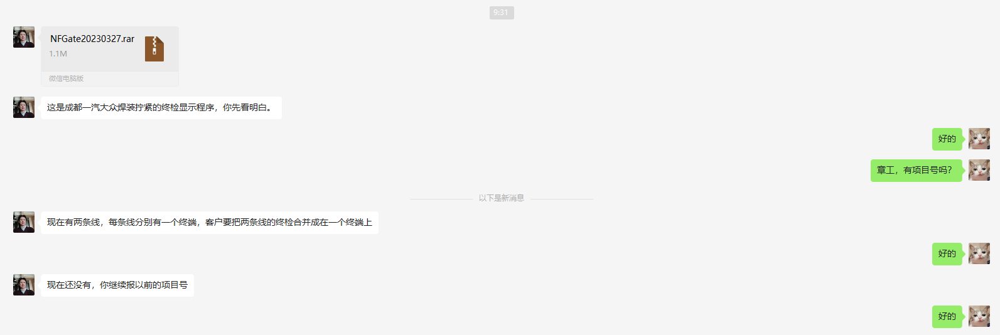
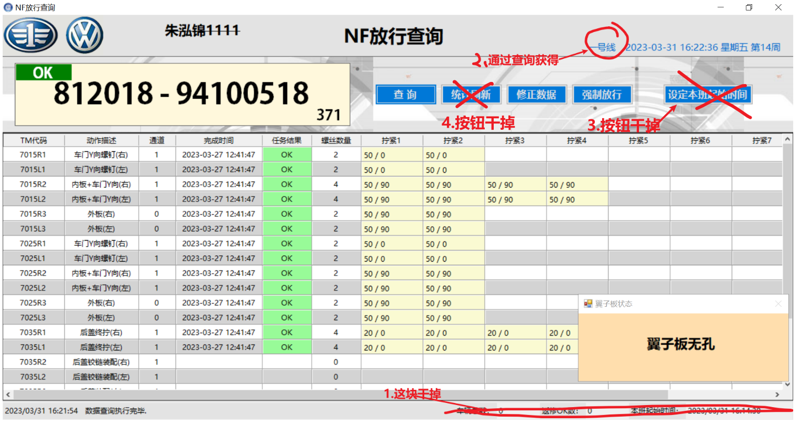

#### 前言：两条线的终检合并到一个终端上。

#### 培训内容：

拧紧数据是从tm_result得到的，你看看查询存储过程

gt_querydata_sel

1. 车号 查询 拧紧数据 → 拧紧数据中的拧紧枪Code 查询 产线 → 产线line 做回显 和 数据查询的参数

2. 系统扫描枪 提供的数据 只有 车号。

3. 样式不动，只改代码

4. 需要删除一些东西 。

5. “一号线”这个位置平时应该是空的，当有车号的时候，通过查询获得产线数据

6. 程序的触发：

   ​			① 串口接到扫码数据，扫码数据也就是车号uart_DataReceived方法里的

   ​						string vincode = Encoding.UTF8.GetString(uartBuffer, 0, len + 1);

   ​            ② 另一个是从数据库查询

   

#### 开发记录

##### 2023年4月6日09:41:02

```txt
1.删除最下面那一行的统计数据的控件展示和代码
2.删除设定本班起始时间的 控件展示和代码
3.删除统计刷新按钮的 控件展示和代码

TODO： 做通过查询获得line参数，将配置文件获取变为存储过程获取
```
